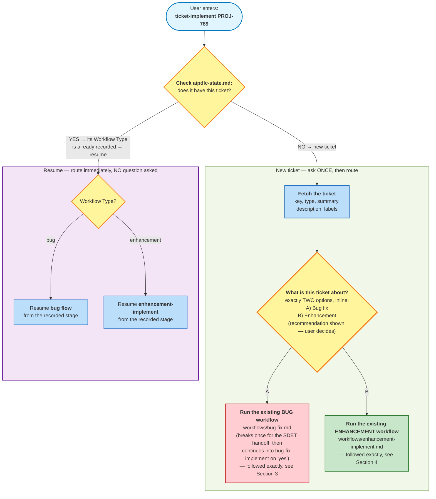
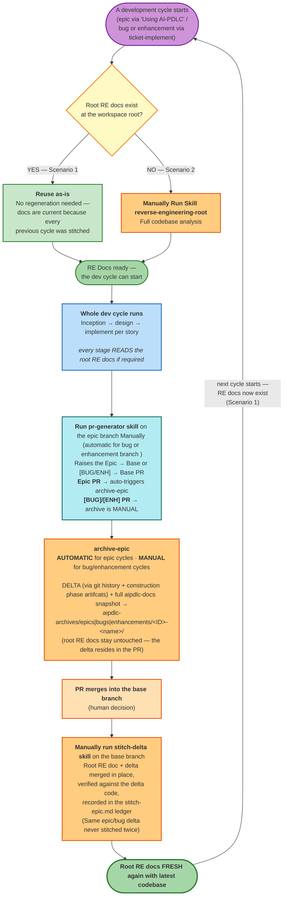
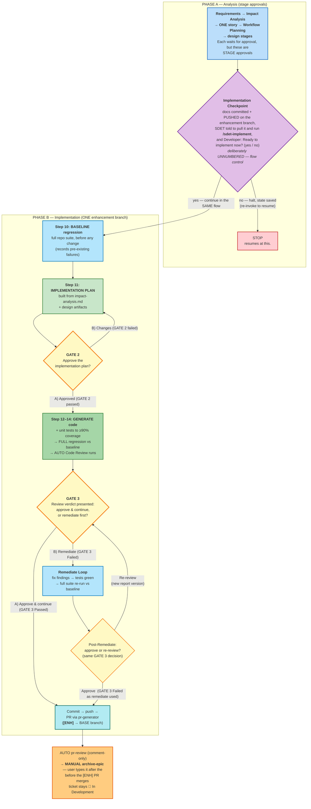
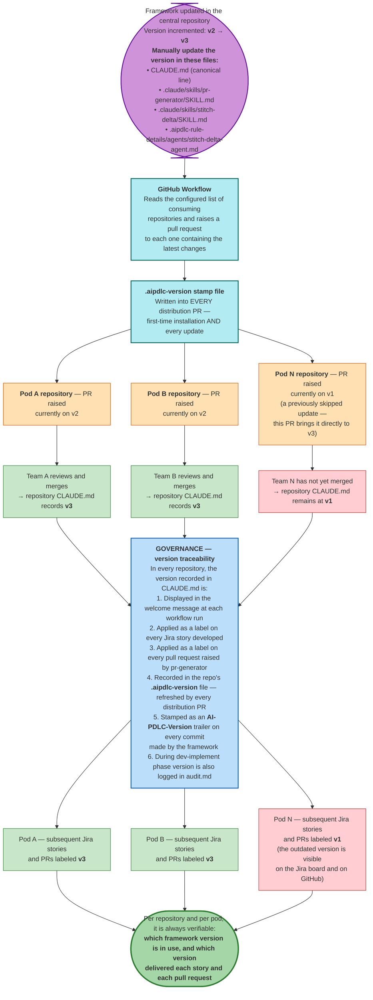

# AI-PDLC Workflow — End-to-End Flows

## Index

1. [Greenfield End-to-End Flow — From Idea to Epic Release](#1-greenfield-end-to-end-flow--from-idea-to-epic-release)
2. [Brownfield End-to-End Flow — From Idea to Epic Release](#2-brownfield-end-to-end-flow--from-idea-to-epic-release)
3. [Bug End-to-End Flow — From Defect Ticket to Merged Fix](#3-bug-end-to-end-flow--from-defect-ticket-to-merged-fix)
4. [Enhancement End-to-End Flow — From Enhancement Ticket to Merged Change](#4-enhancement-end-to-end-flow--from-enhancement-ticket-to-merged-change)
5. [Unified Ticket Router — `ticket-implement` Routes to Bug or Enhancement](#5-unified-ticket-router--ticket-implement-routes-to-bug-or-enhancement)
6. [SDET Bug Lifecycle — From the SDET Raising the Bug to Ready for Testing](#6-sdet-bug-lifecycle--from-the-sdet-raising-the-bug-to-ready-for-testing)
7. [SDET Toolkit — Which Skill to Use When](#7-sdet-toolkit--which-skill-to-use-when)
8. [Reverse Engineering Docs Lifecycle — How the Docs Always Stay Fresh](#8-reverse-engineering-docs-lifecycle--how-the-docs-always-stay-fresh)
9. [Approval Gates — GATE 1, GATE 2, GATE 3](#9-approval-gates--gate-1-gate-2-gate-3)
    - 9.1 [Epic flow — GATE 1, GATE 2, GATE 3](#91-epic-flow--gate-1-gate-2-gate-3)
    - 9.2 [Bug flow — GATE 2 and GATE 3 only](#92-bug-flow--gate-2-and-gate-3-only)
    - 9.3 [Enhancement flow — GATE 2 and GATE 3 only ](#93-enhancement-flow--gate-2-and-gate-3-only)
10. [Distribution & Governance](#10-distribution--governance)
11. [AI Defect Ratio Detection — Line-Level Provenance Flow](#11-ai-defect-ratio-detection--line-level-provenance-flow)


---

# 1. Greenfield End-to-End Flow — From Idea to Epic Release

> Complete lifecycle:

```mermaid
flowchart TD
    %% ═══════════════════════════════════════════════════
    %% PHASE 0: IDEATION — Before AIPDLC Workflow
    %% ═══════════════════════════════════════════════════

    IDEA([" User has an idea"])
    IDEA --> INTAKE["<b>intent-intake skill (manual)</b><br/>Gather 6 baseline fields:<br/>Outcome, KPI, Success signal,<br/>Out-of-scope, Constraints, Confidence"]
    INTAKE -->|"createJiraIssue (Epic)"| JIRA_EPIC["Epic created in Jira<br/>(baseline — thin)"]

    JIRA_EPIC --> REFINE["<b>intent-refinement skill (manual)</b><br/>Elaborate Epic to full detail:<br/>Measurable criteria, constraints,<br/>domain context, NFRs, risks"]
    REFINE -->|"updateJiraIssue"| JIRA_EPIC_FINAL["Final Epic in Jira<br/>(fully detailed, ready to build)"]

    %% ═══════════════════════════════════════════════════
    %% PHASE 1: INCEPTION — Planning & Architecture
    %% ═══════════════════════════════════════════════════

    JIRA_EPIC_FINAL --> TRIGGER(["User enters:<br/><b>using aipdlc implement &lt;JIRA EPIC KEY&gt;</b>"])

    TRIGGER --> WD["<b>Workspace Detection</b><br/>• Greenfield (empty workspace)<br/>• Fetch Epic content → epic-brief.md<br/>• Record ## Jira in aipdlc-state.md"]
    WD --> BRANCH["<b>Create Epic Branch</b><br/>by the name of epic/epic-number-epic-title<br/>Record base branch + epic branch<br/>in aipdlc-state.md"]

    BRANCH --> RA["<b>Requirements Analysis</b><br/>• Read epic-brief.md (defines WHAT to build)<br/>• Determine depth (minimal/standard/comprehensive)<br/>• Generate clarifying questions .md<br/>• Include Extension opt-in prompts"]
    RA --> RA_GATE{"User answers<br/>all questions"}
    RA_GATE -->|"Ambiguity detected"| RA_FOLLOW["Follow-up questions<br/>(resolve before proceeding)"]
    RA_FOLLOW --> RA_GATE
    RA_GATE -->|"All clear"| RA_GEN["Generate requirements.md<br/>+ Security Mandatory + Record Extension Configuration"]
    RA_GEN --> RA_APPROVE{"User approves<br/>requirements"}
    RA_APPROVE -->|"Changes needed"| RA
    RA_APPROVE -->|"Approved "| RA_COMMIT["Commit inception artifacts<br/>on epic branch + push to GitHub<br/>+ raise Epic PR → base branch<br/>(via pr-generator)"]

    RA_COMMIT --> GH_EPIC[("GitHub<br/>Epic PR open → base")]

    %% ═══════════════════════════════════════════════════
    %% USER STORIES
    %% ═══════════════════════════════════════════════════

    RA_COMMIT --> TEAM["<b>User Stories — Part 1</b><br/> Ask team size FIRST<br/>(drives story granularity:<br/>≥ team_size)"]
    TEAM --> MODE[" Story creation mode:<br/>A) One by one (per-story approval)<br/>B) All at once (single review)"]
    MODE --> US_GEN["<b>User Stories — Part 2: Generation</b><br/>Generate stories.md + personas.md<br/>Populate Story Tracker<br/>(Status:  Ready for Development)"]

    US_GEN --> GATE1{"<b>GATE 1: Final Approval</b><br/>Review ALL stories<br/>(regardless of creation mode)<br/>Approve complete story set"}
    GATE1 -->|"Revisions needed"| US_GEN
    GATE1 -->|"Approved "| PUSH_JIRA["<b>User Stories — Part 3: Push to Jira</b><br/>• Confirm PROJECT_KEY<br/>• Create each story in Jira<br/>• Transition to 'Ready for Development'<br/>• Link each story to Parent Epic (verify)<br/>• Write Jira keys back to stories.md"]
    PUSH_JIRA -->|"createJiraIssue × N + linkIssue"| JIRA_STORIES[("Jira: N stories<br/>linked to Parent Epic")]

    %% ═══════════════════════════════════════════════════
    %% DEPENDENCY GRAPH + WORKFLOW PLANNING
    %% ═══════════════════════════════════════════════════

    PUSH_JIRA --> DG["<b>Dependency Graph</b><br/>• It tell how stories are dependent on each other<br/>• Write dependency-graph.yml<br/>• Add Mermaid graph to aipdlc-state.md<br/>• Show: M stories ready now "]
    DG --> DG_GATE{"Approve<br/>dependency graph"}
    DG_GATE -->|"Revise"| DG
    DG_GATE -->|"Approved "| WP["<b>Workflow Planning</b><br/>• Determine EXECUTE/SKIP per design stage<br/>• Generate execution-plan.md<br/>• Mermaid visualization"]
    WP --> WP_GATE{"Approve<br/>workflow plan"}
    WP_GATE -->|"Override stages"| WP
    WP_GATE -->|"Approved "| CONSTRUCTION

    %% ═══════════════════════════════════════════════════
    %% CONSTRUCTION PHASE — DESIGN (System-Level, Single Pass)
    %% ═══════════════════════════════════════════════════

    CONSTRUCTION["<b>CONSTRUCTION PHASE</b><br/>System-Level Design Stages<br/>(single pass, NO code generated here)"]
    CONSTRUCTION --> FD["Functional Design<br/>(CONDITIONAL)"]
    FD --> NFR_R["NFR Requirements<br/>(CONDITIONAL)"]
    NFR_R --> NFR_D["NFR Design<br/>(CONDITIONAL)"]
    NFR_D --> INFRA["Infrastructure Design<br/>(CONDITIONAL)"]

    INFRA --> STOP[" <b>MANDATORY STOP — Development Handoff</b><br/>Design artifacts are <b>committed + pushed on the epic branch</b><br/>(automatic)<br/><br/> N stories created<br/> M stories ready to start<br/>Design stages: [ran/skipped]<br/><br/><b>DEV: pull the epic branch, then type dev-implement</b> (once per story)<br/><b>SDET: pull the epic branch, then type /sdet-implement &lt;story&gt;</b> (once per story)<br/><i>both run in parallel from here — SDET never waits for dev code</i>"]

    %% ═══════════════════════════════════════════════════
    %% DEV-IMPLEMENT — Per-Story Code Generation
    %% ═══════════════════════════════════════════════════

    STOP -->|"User types: <b>dev-implement</b><br/>(once per story)"| SS

    SS["<b>Story Selection</b><br/>Show ready stories<br/>(every requires: Ready for Testing, or its PR merged)<br/>User picks by story ID or Jira key"]
    SS --> DOABLE{"<b>Doability Checkpoint</b>"}
    DOABLE -->|"No — blocked"| BLOCK["List outstanding prerequisites<br/>+ show which stories ARE ready"]
    BLOCK --> SS
    DOABLE -->|"Yes — doable"| INDEV["<b>Story → In Development</b><br/>Update Story Tracker + Start date<br/>Jira Sync: auto-transition to In Development<br/>+ add <b>AIPDLC version label</b> on the Jira story<br/>(version read from CLAUDE.md)"]

    INDEV --> SBG{"<b>Story Branch Checkpoint</b><br/>All prerequisite story PRs<br/>MERGED into epic branch?"}
    SBG -->|"No — prerequisite PR unmerged<br/> WARN + STOP<br/>Revert story to  Ready"| SS
    SBG -->|"Yes — all merged"| SBR["<b>Create Story Branch</b><br/>by the name of story/N.M-story-title<br/>(cut FROM epic branch, NEVER base)"]

    SBR --> BASE["<b>BASELINE Regression Run</b><br/>(automatic, on the story branch,<br/>before any code is written)<br/>• Run ENTIRE repo test suite<br/>• Record the current tests result<br/><br/>→ baseline-regression.log<br/>"]

    BASE --> PLAN["<b>Code Gen Part 1: PLAN</b><br/>• Analyze story + acceptance criteria<br/>• Create implementation steps<br/>• Structure, logic, API, tests, docs"]
    PLAN --> PLAN_GATE{"GATE 2: User<br/>approves plan"}
    PLAN_GATE -->|"Changes"| PLAN
    PLAN_GATE -->|"Approved "| GEN["<b>Code Gen Part 2: GENERATE</b><br/>• Execute each plan step<br/>• Write code to workspace root<br/>• Mark [x] after each step"]

    GEN --> COV["<b>Unit Test + Coverage</b><br/>• Generate tests<br/>• RUN tests — fix failures<br/>• Measure coverage on new code<br/>• Iterate until ≥ 90%<br/>• <b>Coverage proof</b>: test RUN LOGS captured<br/>as evidence (X/X passing + measured %)<br/>in aipdlc-docs\construction\code\"]

    COV --> REG["<b>New FULL Regression vs Prev BASELINE</b><br/>(automatic)<br/>• Re-run ENTIRE suite again and compare against the baseline<br/>• NEW failure = broken BY this story<br/>→ gets fix in same run, iterate until clean<br/>"]

    REG --> ACR["<b>AUTO Code Review</b><br/>(not asked — always runs)<br/>• Verify each acceptance criterion<br/>• Blocker / High only<br/>• Produce versioned report:<br/>  story-N.M-code-review-vX.md"]

    ACR --> RDG{"<b>Review Decision</b><br/>Verdict: clean or findings?"}
    RDG -->|"GATE 3: Remediate"| REM["<b>Remediate Loop</b><br/>• Build backlog from report<br/>• Confirm scope — HALT until user confirms<br/>• Fix each: fix → unit test for the story → green<br/>• Annotate report with resolution"]
    REM --> REM_DECIDE{"Post-Remediate<br/>Decision"}
    REM_DECIDE -->|"B) Re-review"| ACR
    REM_DECIDE -->|" GATE 3: Approve "| COMMIT

    RDG -->|"GATE 3: Approve & continue"| COMMIT["<b>Commit + Push Story Branch</b><br/>git add + commit on story branch"]

    COMMIT --> STORY_PR["<b>pr-generator</b> (invoked by workflow)<br/>Push story branch<br/>Open STORY PR → EPIC BRANCH<br/>Add 'ai-generated' label<br/>+ the <b>AIPDLC version label</b>"]
    STORY_PR --> GH_STORY[("GitHub:<br/>Story PR → epic branch")]

    STORY_PR --> PR_REV["<b>AUTO pr-review</b><br/>on the story PR<br/>"]

    PR_REV --> RFD["<b>Story STAYS  In Development</b><br/>after the PR is raised —<br/>End date + PR link recorded,<br/>Jira comment with PR link added<br/>"]

    %% ═══════════════════════════════════════════════════
    %% MERGE + NEXT STORY LOOP
    %% ═══════════════════════════════════════════════════

    RFD --> MERGE_STORY["<b>User merges Story PR</b><br/>into EPIC BRANCH<br/>(required before dependent stories<br/>can pass Story Branch checkpoint)"]

    MERGE_STORY -.-> SYNC
    MERGE_STORY --> MORE{"More stories<br/>to implement?"}
    MORE -->|"Yes — user types<br/>dev-implement again"| MCHK["<b>LIVE prerequisite check</b> (Doability checkpoint, per pick)<br/>Only for the prerequisites of the story being picked:<br/>is that prerequisite's PR MERGED into the epic branch?<br/>YES → proceed &nbsp;|&nbsp; NO → STOP, merge it first (Manual) <br/>"]
    MCHK --> SS
    MORE -->|"No — all stories done"| ALL_DONE

    %% ═══════════════════════════════════════════════════
    %% POST-DEVELOPMENT: EPIC CLOSE + RELEASE
    %% ═══════════════════════════════════════════════════


    %% ═══════════════════════════════════════════════════
    %% SDET PARALLEL TRACK — starts as soon as stories exist,
    %% does NOT wait for dev. Not a Construction stage.
    %% ═══════════════════════════════════════════════════

    STOP -.->|"SDET works in PARALLEL —<br/>never waits for dev code"| SDETBT["<b>SDET types /sdet-implement &lt;story-JIRA-ID&gt;</b> on the epic branch<br/>A branch <b>sdet/&lt;story-JIRA-ID&gt;-&lt;story-title&gt;</b> is cut<br/>from the LATEST epic branch — Run Test section of construction phase per story<br/>Reads the story's ACCEPTANCE CRITERIA<br/>(Jira + requirements + design)<br/><b>never reads application source code</b><br/>Writes MANUAL test steps →<br/>aipdlc-docs/tests/&lt;story-JIRA-ID&gt;-title/<br/>integration · e2e · api ·<br/>contract · security · performance<br/><i>Every AC covered, then committed and a PR raised<br/>to the epic branch; logged in audit.md.<br/>Conflicts are avoided by .gitattributes (append merge)</i>"]
    SDETBT -.->|"repeat per story,<br/>"| SDETBT
    SDETBT -.-> SYNC

    ALL_DONE["All stories developed<br/>+ all story PRs merged into epic branch (manual merge)"]

    ALL_DONE --> SYNC["<b>/sdet-list-work</b><br/>run MANUALLY by SDET on the EPIC BRANCH and SDET chooses option A<br/><br/>1. Pulls the latest epic branch<br/>2. Lists every story whose PR has MERGED,<br/>&nbsp;&nbsp;&nbsp;which is still In Development<br/>3. SDET tests them by executing the manual test steps generated by /sdet-implement skill<br/>&nbsp;&nbsp;&nbsp;(can be run in a separate terminal)<br/>The SDET runs /sdet-list-work again and chooses option B and takes one decision per story:<br/>&nbsp;&nbsp;&nbsp;<b>&lt;story&gt; approve</b> &nbsp;or&nbsp; <b>&lt;story&gt; reject</b><br/>&nbsp;&nbsp;&nbsp;e.g. Proj-102 approve, PROJ-103 reject<br/><br/><b>APPROVE</b> → Jira comment 'SDET approved the story'<br/>+ <b>sdet-approved</b> label + Transition to → <b>Ready for Testing</b><br/>(Story Tracker)<br/><b>REJECT</b> → Jira comment 'SDET rejected the story'<br/>+ <b>sdet-rejected</b> label<b> + Ticket stays In Development</b><br/>(SDET manually log the defect with /raise-defect)<br/><br/>Both outcomes logged in audit.md<i> Run it per story as soon as THAT story's PR merges —<br/></i><br/> When ALL stories are approved in an Epic → it offers to transition<br/><b>Parent Epic → Ready for Testing</b>"]

    SYNC --> EPIC_PR["<b>Manually run pr-generator</b> (on epic branch)<br/>when Epic branch is up-to-date with all stories<br/>Raise/update EPIC PR → BASE BRANCH"]
    EPIC_PR --> GH_EPIC_FINAL[("GitHub:<br/>Epic PR → base branch<br/>(all story code included)")]

    EPIC_PR --> ARCHIVE["<b>archive-epic (automatic) on epic branch </b><br/>1. Generate DELTA RE artifacts<br/>   (ADD-ONLY in delta/EPIC-ID-name/)<br/>   Root docs stay byte-identical<br/>2. Archive aipdlc-docs/ →<br/>   aipdlc-archives/epics/EPIC-ID-name/<br/>3. Commit + push on epic branch<br/>   (resides the open Epic PR)"]

    ARCHIVE --> MERGE_EPIC["<b>User merges Epic PR</b><br/>into BASE BRANCH<br/>(human decision)"]


    ARCHIVE --> DONE(["<b>EPIC COMPLETE</b>"])

    %% ═══════════════════════════════════════════════════
    %% STYLING
    %% ═══════════════════════════════════════════════════

    %% Ideation (lavender)
    style IDEA fill:#EDE7F6,stroke:#5E35B1,stroke-width:2px
    style INTAKE fill:#D1C4E9,stroke:#5E35B1,stroke-width:2px
    style JIRA_EPIC fill:#D1C4E9,stroke:#5E35B1
    style REFINE fill:#D1C4E9,stroke:#5E35B1,stroke-width:2px
    style JIRA_EPIC_FINAL fill:#B39DDB,stroke:#5E35B1,stroke-width:2px

    %% Trigger
    style TRIGGER fill:#CE93D8,stroke:#6A1B9A,stroke-width:3px

    %% Inception (blue)
    style WD fill:#BBDEFB,stroke:#1565C0,stroke-width:2px
    style BRANCH fill:#BBDEFB,stroke:#1565C0,stroke-width:2px
    style RA fill:#BBDEFB,stroke:#1565C0,stroke-width:2px
    style RA_GEN fill:#BBDEFB,stroke:#1565C0
    style RA_FOLLOW fill:#BBDEFB,stroke:#1565C0
    style RA_COMMIT fill:#90CAF9,stroke:#1565C0,stroke-width:2px
    style TEAM fill:#BBDEFB,stroke:#1565C0,stroke-width:2px
    style MODE fill:#BBDEFB,stroke:#1565C0
    style US_GEN fill:#BBDEFB,stroke:#1565C0,stroke-width:2px
    style PUSH_JIRA fill:#BBDEFB,stroke:#1565C0,stroke-width:2px
    style DG fill:#BBDEFB,stroke:#1565C0,stroke-width:2px
    style WP fill:#BBDEFB,stroke:#1565C0,stroke-width:2px

    %% Gates (amber)
    style GATE1 fill:#FFF9C4,stroke:#F57F17,stroke-width:3px
    style RA_GATE fill:#FFF9C4,stroke:#F57F17
    style RA_APPROVE fill:#FFF9C4,stroke:#F57F17
    style DG_GATE fill:#FFF9C4,stroke:#F57F17
    style WP_GATE fill:#FFF9C4,stroke:#F57F17
    style PLAN_GATE fill:#FFF9C4,stroke:#F57F17

    %% Construction design (purple)
    style CONSTRUCTION fill:#F3E5F5,stroke:#6A1B9A,stroke-width:2px
    style FD fill:#E1BEE7,stroke:#6A1B9A
    style NFR_R fill:#E1BEE7,stroke:#6A1B9A
    style NFR_D fill:#E1BEE7,stroke:#6A1B9A
    style INFRA fill:#E1BEE7,stroke:#6A1B9A

    %% STOP gate (red)
    style STOP fill:#FFCDD2,stroke:#C62828,stroke-width:3px

    %% dev-implement (green)
    style SS fill:#C8E6C9,stroke:#2E7D32,stroke-width:2px
    style BLOCK fill:#FFCDD2,stroke:#C62828
    style INDEV fill:#C8E6C9,stroke:#2E7D32,stroke-width:2px
    style SBR fill:#C8E6C9,stroke:#2E7D32,stroke-width:2px
    style PLAN fill:#C8E6C9,stroke:#2E7D32,stroke-width:2px
    style GEN fill:#A5D6A7,stroke:#2E7D32,stroke-width:2px
    style BASE fill:#A5D6A7,stroke:#2E7D32,stroke-width:2px
    style COV fill:#A5D6A7,stroke:#2E7D32,stroke-width:2px
    style REG fill:#A5D6A7,stroke:#2E7D32,stroke-width:2px

    %% Code Review (light blue)
    style ACR fill:#B3E5FC,stroke:#0277BD,stroke-width:2px
    style REM fill:#B3E5FC,stroke:#0277BD
    style PR_REV fill:#B3E5FC,stroke:#0277BD

    %% Decision gates in dev-implement
    style DOABLE fill:#FFF9C4,stroke:#F57F17,stroke-width:2px
    style SBG fill:#FFF9C4,stroke:#F57F17,stroke-width:2px
    style RDG fill:#FFF9C4,stroke:#F57F17,stroke-width:2px
    style REM_DECIDE fill:#FFF9C4,stroke:#F57F17

    %% PR + commit (cyan)
    style COMMIT fill:#E0F7FA,stroke:#00695C,stroke-width:2px
    style STORY_PR fill:#B2EBF2,stroke:#00695C,stroke-width:2px
    style RFD fill:#C8E6C9,stroke:#2E7D32,stroke-width:2px
    style MERGE_STORY fill:#B2EBF2,stroke:#00695C,stroke-width:2px

    %% Post-epic (orange/amber)
    style ALL_DONE fill:#FFF3E0,stroke:#E65100,stroke-width:2px
    style SYNC fill:#B2DFDB,stroke:#00695C,stroke-width:2px
    style EPIC_PR fill:#FFE0B2,stroke:#E65100,stroke-width:2px
    style ARCHIVE fill:#FFCC80,stroke:#E65100,stroke-width:2px
    style MERGE_EPIC fill:#FFE0B2,stroke:#E65100,stroke-width:2px
    style DONE fill:#A5D6A7,stroke:#2E7D32,stroke-width:3px

    %% External systems
    style GH_EPIC fill:#FFF9C4,stroke:#F57F17
    style GH_STORY fill:#FFF9C4,stroke:#F57F17
    style GH_EPIC_FINAL fill:#FFF9C4,stroke:#F57F17
    style JIRA_STORIES fill:#FFF9C4,stroke:#F57F17

    %% More decision
    style MORE fill:#FFF9C4,stroke:#F57F17,stroke-width:2px
    style MCHK fill:#C8E6C9,stroke:#2E7D32,stroke-width:2px
    style SDETBT fill:#B2DFDB,stroke:#00695C,stroke-width:2px
```
# 2. Brownfield End-to-End Flow — From Idea to Epic Release

> Complete lifecycle

```mermaid
flowchart TD
    %% ═══════════════════════════════════════════════════
    %% PHASE 0: IDEATION + REVERSE ENGINEERING (Independent)
    %% ═══════════════════════════════════════════════════

    IDEA([" User has an idea"])
    IDEA --> INTAKE["<b>intent-intake skill (manual)</b><br/>Gather 6 baseline fields:<br/>Outcome, KPI, Success signal,<br/>Out-of-scope, Constraints, Confidence"]
    INTAKE -->|"createJiraIssue (Epic)"| JIRA_EPIC["Epic created in Jira<br/>(baseline — thin)"]

    JIRA_EPIC --> REFINE["<b>intent-refinement skill (manual)</b><br/>Elaborate Epic to full detail:<br/>Measurable criteria, constraints,<br/>domain context, NFRs, risks"]
    REFINE -->|"updateJiraIssue"| JIRA_EPIC_FINAL["Final Epic in Jira<br/>(fully detailed, ready to build)"]

    %% Reverse Engineering — Independent, done ONCE for the repo
    RRE["<b>reverse-engineering-root</b><br/>(run ONCE Manually on base branch)<br/>Generates root RE artifacts for whole repo<br/>Reused by ALL future epics"]

    %% ═══════════════════════════════════════════════════
    %% PHASE 1: INCEPTION — Planning & Architecture
    %% ═══════════════════════════════════════════════════

    JIRA_EPIC_FINAL --> TRIGGER(["User enters:<br/><b>using aipdlc implement PROJ-50</b>"])

    TRIGGER --> WD["<b>Workspace Detection</b><br/>• Brownfield (existing code found)<br/>• Ensure root context-project/ folder (check first, create only if missing)<br/>• RE artifacts already exist → skip RE<br/>• Fetch Epic content → epic-brief.md<br/>• Record ## Jira in aipdlc-state.md"]
    RRE -.->|"Artifacts already present<br/>in workspace (done once)"| WD
    WD --> CTX{"<b>Context Project artifacts?</b><br/>'Are there any context-project artifacts<br/>I should use for this task?'<br/>A) Yes — paste exact path<br/>B) No — continue<br/>(asked ONCE, recorded as ## Context Project in aipdlc-state.md)"}
    CTX -->|"A) Yes — path read as current-system context"| BRANCH
    CTX -->|"B) No"| BRANCH
    BRANCH["<b>Create Epic Branch</b><br/>by the name of epic/epic-number-epic-title<br/>Record base branch + epic branch<br/>in aipdlc-state.md"]

    BRANCH --> RA["<b>Requirements Analysis</b><br/>• Read epic-brief.md (defines WHAT to build)<br/>• Determine depth (minimal/standard/comprehensive)<br/>• Generate clarifying questions .md<br/>• Include Extension opt-in prompts"]
    RA --> RA_GATE{"User answers<br/>all questions"}
    RA_GATE -->|"Ambiguity detected"| RA_FOLLOW["Follow-up questions<br/>(resolve before proceeding)"]
    RA_FOLLOW --> RA_GATE
    RA_GATE -->|"All clear"| RA_GEN["Generate requirements.md<br/>+ Security Mandatory + Record Extension Configuration"]
    RA_GEN --> RA_APPROVE{"User approves<br/>requirements"}
    RA_APPROVE -->|"Changes needed"| RA
    RA_APPROVE -->|"Approved "| RA_COMMIT["Commit inception artifacts<br/>on epic branch + push to GitHub<br/>+ raise Epic PR → base branch<br/>(via pr-generator)"]

    RA_COMMIT --> GH_EPIC[("GitHub<br/>Epic PR open → base")]

    %% ═══════════════════════════════════════════════════
    %% USER STORIES
    %% ═══════════════════════════════════════════════════

    RA_COMMIT --> TEAM["<b>User Stories — Part 1</b><br/> Ask team_size FIRST<br/>(drives story granularity:<br/>≥ team_size)"]
    TEAM --> MODE[" Story creation mode:<br/>A) One by one (per-story approval)<br/>B) All at once (single review)"]
    MODE --> US_GEN["<b>User Stories — Part 2: Generation</b><br/>Generate stories.md + personas.md<br/>Populate Story Tracker<br/>(Status:  Ready for Development)"]

    US_GEN --> GATE1{"<b>GATE 1: Final Approval</b><br/>Review ALL stories<br/>(regardless of creation mode)<br/>Approve complete story set"}
    GATE1 -->|"Revisions needed"| US_GEN
    GATE1 -->|"Approved "| PUSH_JIRA["<b>User Stories — Part 3: Push to Jira</b><br/>• Confirm PROJECT_KEY<br/>• Create each story in Jira<br/>• Transition to 'Ready for Development'<br/>• Link each story to Parent Epic (verify)<br/>• Write Jira keys back to stories.md"]
    PUSH_JIRA -->|"createJiraIssue × N + linkIssue"| JIRA_STORIES[("Jira: N stories<br/>linked to Parent Epic")]

    %% ═══════════════════════════════════════════════════
    %% DEPENDENCY GRAPH + WORKFLOW PLANNING
    %% ═══════════════════════════════════════════════════

    PUSH_JIRA --> DG["<b>Dependency Graph</b><br/>• It tell how stories are dependent on each other<br/>• Write dependency-graph.yml<br/>• Add Mermaid graph to aipdlc-state.md<br/>• Show: M stories ready now "]
    DG --> DG_GATE{"Approve<br/>dependency graph"}
    DG_GATE -->|"Revise"| DG
    DG_GATE -->|"Approved "| WP["<b>Workflow Planning</b><br/>• Determine EXECUTE/SKIP per design stage<br/>• Generate execution-plan.md<br/>• Mermaid visualization"]
    WP --> WP_GATE{"Approve<br/>workflow plan"}
    WP_GATE -->|"Override stages"| WP
    WP_GATE -->|"Approved "| CONSTRUCTION

    %% ═══════════════════════════════════════════════════
    %% CONSTRUCTION PHASE — DESIGN (System-Level, Single Pass)
    %% ═══════════════════════════════════════════════════

    CONSTRUCTION["<b>CONSTRUCTION PHASE</b><br/>System-Level Design Stages<br/>(single pass, NO code generated here)"]
    CONSTRUCTION --> FD["Functional Design<br/>(CONDITIONAL)"]
    FD --> NFR_R["NFR Requirements<br/>(CONDITIONAL)"]
    NFR_R --> NFR_D["NFR Design<br/>(CONDITIONAL)"]
    NFR_D --> INFRA["Infrastructure Design<br/>(CONDITIONAL)"]

    INFRA --> STOP[" <b>MANDATORY STOP — Development Handoff</b><br/>Design artifacts are <b>committed + pushed on the epic branch</b><br/>(automatic — this is what unblocks SDET)<br/><br/> N stories created<br/> M stories ready to start<br/> Design stages: [ran/skipped]<br/><br/><b>DEV: pull the epic branch, then type dev-implement</b> (once per story)<br/><b>SDET: pull the epic branch, then type /sdet-implement &lt;story&gt;</b> (once per story)<br/><i>both run in parallel from here — SDET never waits for dev code</i>"]

    %% ═══════════════════════════════════════════════════
    %% DEV-IMPLEMENT — Per-Story Code Generation
    %% ═══════════════════════════════════════════════════

    STOP -->|"User types: <b>dev-implement</b><br/>(once per story)"| SS

    SS["<b>Story Selection</b><br/>Show ready stories<br/>(every requires: Ready for Testing, or its PR merged)<br/>User picks by story ID or Jira key"]
    SS --> DOABLE{"<b>Doability Checkpoint</b>"}
    DOABLE -->|"No — blocked"| BLOCK["List outstanding prerequisites<br/>+ show which stories ARE ready"]
    BLOCK --> SS
    DOABLE -->|"Yes — doable"| INDEV["<b>Story →  In Development</b><br/>Update Story Tracker + Start date<br/>Jira Sync: auto-transition<br/>+ add <b>AIPDLC version label</b> on the Jira story<br/>(version read from CLAUDE.md)"]

    INDEV --> SBG{"<b>Story Branch checkpoint</b><br/>All prerequisite story PRs<br/>MERGED into epic branch?"}
    SBG -->|"No — prerequisite PR unmerged<br/> WARN + STOP<br/>Revert story to  Ready"| SS
    SBG -->|"Yes — all merged"| SBR["<b>Create Story Branch</b><br/>git fetch + checkout epic branch + pull --ff-only<br/>git checkout -b story/N.M-kebab-title<br/>(cut FROM epic branch, NEVER base)"]

    SBR --> BASE["<b>BASELINE Regression Run</b><br/>(automatic, on the story branch,<br/>before any code is written)<br/>• Run ENTIRE repo test suite<br/>• Record the current test results<br/><br/>→ baseline-regression.log<br/>"]

    BASE --> PLAN["<b>Code Gen Part 1: PLAN</b><br/>• Analyze story + acceptance criteria<br/>• Create implementation steps<br/>• Structure, logic, API, tests, docs"]
    PLAN --> PLAN_GATE{"GATE 2: User<br/>approves plan"}
    PLAN_GATE -->|"Changes"| PLAN
    PLAN_GATE -->|"Approved "| GEN["<b>Code Gen Part 2: GENERATE</b><br/>• Execute each plan step<br/>• Write code to workspace root<br/>• Mark [x] after each step"]

    GEN --> COV["<b>Unit Test + Coverage</b><br/>• Generate tests<br/>• RUN tests — fix failures<br/>• Measure coverage on new code<br/>• Iterate until ≥ 90%<br/>• <b>Coverage proof</b>: test RUN LOGS captured<br/>as evidence (X/X passing + measured %)<br/>in aipdlc-docs\construction\code\"]

    COV --> REG["<b>New FULL Regression vs Prev BASELINE</b><br/>(automatic)<br/>• Re-run ENTIRE suite again and compare against the baseline<br/>• NEW failure = broken BY this story<br/>→ gets fix in same run, iterate until clean<br/>"]

    REG --> ACR["<b>AUTO Code Review</b><br/>(not asked — always runs)<br/>• Verify each acceptance criterion<br/>• 🔴 Blocker / 🟠 High only<br/>• Produce versioned report:<br/>  story-N.M-code-review-vX.md"]

    ACR --> RDG{"<b>Review Decision</b><br/>Verdict: clean or findings?"}
    RDG -->|"GATE 3: Remediate"| REM["<b>Remediate Loop</b><br/>• Build backlog from report<br/>• Confirm scope — HALT until user confirms<br/>• Fix each: fix → unit test of that story → green<br/>• Annotate report with resolution"]
    REM --> REM_DECIDE{"Post-Remediate<br/>Decision"}
    REM_DECIDE -->|"B) Re-review"| ACR
    REM_DECIDE -->|" GATE 3: Approve "| COMMIT

    RDG -->|"GATE 3: Approve & continue"| COMMIT["<b>Commit + Push Story Branch</b><br/>git add + commit on story branch"]

    COMMIT --> STORY_PR["<b>pr-generator</b> (invoked by workflow)<br/>Push story branch<br/>Open STORY PR → EPIC BRANCH<br/>Add 'ai-generated' label<br/>+ the same <b>AIPDLC version label</b>"]
    STORY_PR --> GH_STORY[("GitHub:<br/>Story PR → epic branch")]

    STORY_PR --> PR_REV["<b>AUTO pr-review</b><br/>on the story PR<br/>"]

    PR_REV --> RFD["<b>Story STAYS  In Development</b><br/>after the PR is raised —<br/>End date + PR link recorded,<br/>Jira comment with PR link added<br/>"]

    %% ═══════════════════════════════════════════════════
    %% MERGE + NEXT STORY LOOP
    %% ═══════════════════════════════════════════════════

    RFD --> MERGE_STORY["<b>User merges Story PR</b><br/>into EPIC BRANCH<br/>(required before dependent stories<br/>can pass Story Branch checkpoint)"]


    MERGE_STORY -.-> SYNC
    MERGE_STORY --> MORE{"More stories<br/>to implement?"}
    MORE -->|"Yes — user types<br/>dev-implement again"| MCHK["<b>LIVE prerequisite check</b> (Doability checkpoint, per pick)<br/>Only for the prerequisites of the story being picked:<br/>is that prerequisite's PR MERGED into the epic branch?<br/>YES → proceed &nbsp;|&nbsp; NO → 🛑 STOP, merge it first (manual) <br/>"]
    MCHK --> SS
    MORE -->|"No — all stories done "| ALL_DONE

    %% ═══════════════════════════════════════════════════
    %% POST-DEVELOPMENT: EPIC CLOSE + RELEASE
    %% ═══════════════════════════════════════════════════


    %% ═══════════════════════════════════════════════════
    %% SDET PARALLEL TRACK — starts as soon as stories exist,
    %% does NOT wait for dev. Not a Construction stage.
    %% ═══════════════════════════════════════════════════

    STOP -.->|"SDET works in PARALLEL —<br/> never waits for dev code"| SDETBT["<b>SDET types /sdet-implement &lt;story-JIRA-ID&gt;</b> on the epic branch<br/>A branch <b>sdet/&lt;story-JIRA-ID&gt;-&lt;story-title&gt;</b> is cut<br/>from the LATEST epic branch —  Run Test section of construction phase per story <br/>Reads the story's ACCEPTANCE CRITERIA<br/>(Jira + requirements + design)<br/><b>never reads application source code</b><br/>Writes MANUAL test steps →<br/>aipdlc-docs/tests/&lt;story-JIRA-ID&gt;-title/<br/>integration · e2e · api ·<br/>contract · security · performance<br/><i>Every AC covered, then committed and a PR raised<br/>to the epic branch; logged in audit.md.<br/>Conflicts are avoided by .gitattributes (append merge)</i>"]
    SDETBT -.->|"repeat per story"| SDETBT
    SDETBT -.-> SYNC

    ALL_DONE["All stories completed <br/>+ all story PRs merged into epic branch (human decision)"]

    ALL_DONE --> SYNC["<b>/sdet-list-work</b><br/>run MANUALLY by SDET on the EPIC BRANCH and SDET chooses option A<br/><br/>1. Pulls the latest epic branch<br/>2. Lists every story whose PR has MERGED,<br/>&nbsp;&nbsp;&nbsp;which is still In Development<br/>3. SDET tests them by executing the manual test steps generated by /sdet-implement skill<br/>&nbsp;&nbsp;&nbsp;(can be run in a separate terminal)<br/>The SDET runs /sdet-list-work again and chooses option B and takes one decision per story:<br/>&nbsp;&nbsp;&nbsp;<b>&lt;story&gt; approve</b> &nbsp;or&nbsp; <b>&lt;story&gt; reject</b><br/>&nbsp;&nbsp;&nbsp;e.g. Proj-102 approve, PROJ-103 reject<br/><br/><b>APPROVE</b> → Jira comment 'SDET approved the story'<br/>+ <b>sdet-approved</b> label + Transition to → <b>Ready for Testing</b><br/>(Story Tracker)<br/><b>REJECT</b> → Jira comment 'SDET rejected the story'<br/>+ <b>sdet-rejected</b> label<b> + Ticket stays In Development</b><br/>(SDET manually log the defect with /raise-defect)<br/><br/>Both outcomes logged in audit.md<i> Run it per story as soon as THAT story's PR merges —<br/></i><br/> When ALL stories are approved in an Epic → it offers to transition<br/><b>Parent Epic → Ready for Testing</b>"]

    SYNC --> EPIC_PR["<b>Manually run pr-generator</b> (on epic branch)<br/>when Epic branch is up-to-date with all stories<br/>Raise/update EPIC PR → BASE BRANCH"]
    EPIC_PR --> GH_EPIC_FINAL[("GitHub:<br/>Epic PR → base branch<br/>(all story code included)")]

    EPIC_PR --> ARCHIVE["<b>automatic archive-epic</b><br/>1. Generate DELTA RE artifacts<br/>   (ADD-ONLY delta RE docs)<br/>   Root docs stay byte-identical<br/>2. Archive aipdlc-docs/ →<br/>   aipdlc-archives/epics/EPIC-ID-name/<br/>3. Commit + push on epic branch<br/>   (resides the open Epic PR)"]

    ARCHIVE --> MERGE_EPIC["<b>User merges Epic PR</b><br/>into BASE BRANCH<br/>(human decision)"]

    MERGE_EPIC --> CHECKOUT_BASE["Checkout base branch<br/>git checkout main && git pull"]

    CHECKOUT_BASE --> STITCH["<b>User manually run the stitch-delta skill</b> (on base branch)<br/>• Read stitch-epic.md ledger<br/>• Find un-stitched deltas<br/>• Stitch delta INTO root RE docs<br/>  (root docs modified in-place)<br/>• Record in ledger<br/>• Commit + push (confirm-first)"]

    STITCH --> DONE(["<b>RELEASE COMPLETE</b><br/>Root reverse-engineering docs<br/>now reflect all epic changes"])

    %% ═══════════════════════════════════════════════════
    %% STYLING
    %% ═══════════════════════════════════════════════════

    %% Ideation (lavender)
    style IDEA fill:#EDE7F6,stroke:#5E35B1,stroke-width:2px
    style INTAKE fill:#D1C4E9,stroke:#5E35B1,stroke-width:2px
    style JIRA_EPIC fill:#D1C4E9,stroke:#5E35B1
    style REFINE fill:#D1C4E9,stroke:#5E35B1,stroke-width:2px
    style JIRA_EPIC_FINAL fill:#B39DDB,stroke:#5E35B1,stroke-width:2px

    %% Reverse Engineering Root (amber/orange — independent)
    style RRE fill:#FFCC80,stroke:#E65100,stroke-width:2px

    %% Trigger
    style TRIGGER fill:#CE93D8,stroke:#6A1B9A,stroke-width:3px

    %% Inception (blue)
    style WD fill:#BBDEFB,stroke:#1565C0,stroke-width:2px
    style BRANCH fill:#BBDEFB,stroke:#1565C0,stroke-width:2px
    style RA fill:#BBDEFB,stroke:#1565C0,stroke-width:2px
    style RA_GEN fill:#BBDEFB,stroke:#1565C0
    style RA_FOLLOW fill:#BBDEFB,stroke:#1565C0
    style RA_COMMIT fill:#90CAF9,stroke:#1565C0,stroke-width:2px
    style TEAM fill:#BBDEFB,stroke:#1565C0,stroke-width:2px
    style MODE fill:#BBDEFB,stroke:#1565C0
    style US_GEN fill:#BBDEFB,stroke:#1565C0,stroke-width:2px
    style PUSH_JIRA fill:#BBDEFB,stroke:#1565C0,stroke-width:2px
    style DG fill:#BBDEFB,stroke:#1565C0,stroke-width:2px
    style WP fill:#BBDEFB,stroke:#1565C0,stroke-width:2px

    %% Gates (amber)
    style GATE1 fill:#FFF9C4,stroke:#F57F17,stroke-width:3px
    style RA_GATE fill:#FFF9C4,stroke:#F57F17
    style RA_APPROVE fill:#FFF9C4,stroke:#F57F17
    style DG_GATE fill:#FFF9C4,stroke:#F57F17
    style WP_GATE fill:#FFF9C4,stroke:#F57F17
    style PLAN_GATE fill:#FFF9C4,stroke:#F57F17

    %% Construction design (purple)
    style CONSTRUCTION fill:#F3E5F5,stroke:#6A1B9A,stroke-width:2px
    style FD fill:#E1BEE7,stroke:#6A1B9A
    style NFR_R fill:#E1BEE7,stroke:#6A1B9A
    style NFR_D fill:#E1BEE7,stroke:#6A1B9A
    style INFRA fill:#E1BEE7,stroke:#6A1B9A

    %% STOP gate (red)
    style STOP fill:#FFCDD2,stroke:#C62828,stroke-width:3px

    %% dev-implement (green)
    style SS fill:#C8E6C9,stroke:#2E7D32,stroke-width:2px
    style BLOCK fill:#FFCDD2,stroke:#C62828
    style INDEV fill:#C8E6C9,stroke:#2E7D32,stroke-width:2px
    style SBR fill:#C8E6C9,stroke:#2E7D32,stroke-width:2px
    style PLAN fill:#C8E6C9,stroke:#2E7D32,stroke-width:2px
    style GEN fill:#A5D6A7,stroke:#2E7D32,stroke-width:2px
    style BASE fill:#A5D6A7,stroke:#2E7D32,stroke-width:2px
    style COV fill:#A5D6A7,stroke:#2E7D32,stroke-width:2px
    style REG fill:#A5D6A7,stroke:#2E7D32,stroke-width:2px

    %% Code Review (light blue)
    style ACR fill:#B3E5FC,stroke:#0277BD,stroke-width:2px
    style REM fill:#B3E5FC,stroke:#0277BD
    style PR_REV fill:#B3E5FC,stroke:#0277BD

    %% Decision gates in dev-implement
    style DOABLE fill:#FFF9C4,stroke:#F57F17,stroke-width:2px
    style SBG fill:#FFF9C4,stroke:#F57F17,stroke-width:2px
    style RDG fill:#FFF9C4,stroke:#F57F17,stroke-width:2px
    style REM_DECIDE fill:#FFF9C4,stroke:#F57F17

    %% PR + commit (cyan)
    style COMMIT fill:#E0F7FA,stroke:#00695C,stroke-width:2px
    style STORY_PR fill:#B2EBF2,stroke:#00695C,stroke-width:2px
    style RFD fill:#C8E6C9,stroke:#2E7D32,stroke-width:2px
    style MERGE_STORY fill:#B2EBF2,stroke:#00695C,stroke-width:2px

    %% Post-epic (orange/amber)
    style ALL_DONE fill:#FFF3E0,stroke:#E65100,stroke-width:2px
    style SYNC fill:#B2DFDB,stroke:#00695C,stroke-width:2px
    style EPIC_PR fill:#FFE0B2,stroke:#E65100,stroke-width:2px
    style ARCHIVE fill:#FFCC80,stroke:#E65100,stroke-width:2px
    style MERGE_EPIC fill:#FFE0B2,stroke:#E65100,stroke-width:2px
    style CHECKOUT_BASE fill:#FFE0B2,stroke:#E65100
    style STITCH fill:#FFCC80,stroke:#E65100,stroke-width:2px
    style DONE fill:#A5D6A7,stroke:#2E7D32,stroke-width:3px

    %% External systems
    style GH_EPIC fill:#FFF9C4,stroke:#F57F17
    style GH_STORY fill:#FFF9C4,stroke:#F57F17
    style GH_EPIC_FINAL fill:#FFF9C4,stroke:#F57F17
    style JIRA_STORIES fill:#FFF9C4,stroke:#F57F17

    %% More decision
    style MORE fill:#FFF9C4,stroke:#F57F17,stroke-width:2px
    style MCHK fill:#C8E6C9,stroke:#2E7D32,stroke-width:2px
    style SDETBT fill:#B2DFDB,stroke:#00695C,stroke-width:2px
```


# 3. Bug End-to-End Flow — From Defect Ticket to Merged Fix

```mermaid
flowchart TD
    %% ═══════════════════════════════════════════════════
    %% PHASE 0: DEFECT EXISTS IN JIRA
    %% ═══════════════════════════════════════════════════

    TRIGGER(["User enters:<br/><b>ticket-implement PROJ-123</b><br/>Router asks: what is this ticket about?<br/>→ <b>User selects option A) Bug fix</b><br/>runs this flow as-is"])

    %% ═══════════════════════════════════════════════════
    %% INCEPTION (TRIMMED)
    %% ═══════════════════════════════════════════════════

    TRIGGER --> TICKET["<b>Ticket Capture</b><br/>• Ensure root context-project/ folder (check first, create only if missing)<br/>• Fetch ticket → bug-brief.md<br/>"]
    TICKET --> CTX{"<b>Context Project artifacts?</b><br/>'Are there any context-project artifacts<br/>I should use for this task?'<br/>A) Yes — paste exact path<br/>B) No — continue<br/>(asked ONCE, recorded as ## Context Project in aipdlc-state.md)"}
    CTX -->|"A) Yes — path read as current-system context"| BRANCH
    CTX -->|"B) No"| BRANCH
    BRANCH["<b>Create BUG Branch</b><br/>bug/PROJ-123-ticket-title<br/>cut from BASE branch<br/>"]

    BRANCH --> RE_CHECK{"RE artifacts<br/>exist?"}
    RE_CHECK -->|"No"| RE["<b>AUtomatic Reverse Engineering</b><br/>"]
    RE_CHECK -->|"Yes — reuse"| RA
    RE --> RA

    RA["<b>Requirements Analysis</b><br/>bug-brief.md is primary input<br/>"]
    RA --> RA_GATE{"User approves<br/>requirements<br/><i>(stage approval)</i>"}
    RA_GATE -->|"Changes"| RA
    RA_GATE -->|"Approved "| IMPACT

    %% ═══════════════════════════════════════════════════
    %% IMPACT ANALYSIS + AI-ORIGIN DETECTION (NEW)
    %% ═══════════════════════════════════════════════════

    IMPACT["<b>Impact Analysis</b><br/>• Find affected files + root cause<br/>with file:line evidence<br/>→ impact-analysis.md<br/>(drives the fix plan)"]
    IMPACT --> ORIGIN["<b>Line-Level AI-Origin Detection</b><br/><i>Defect Provenance Analyst Agent</i><br/>• Traces defective lines via git blame<br/>• Maps introducing commit to its PR<br/>• Flags as AI-generated if:<br/>&nbsp;&nbsp;- PR carries <b>'ai-generated'</b> label (pr-generator applies it to every PR it raises)<br/>&nbsp;&nbsp;- Commit contains a <b>Co-Authored-By: Claude<br/>&nbsp;&nbsp;- Commit carries an <b>AI-PDLC-Version</b>(stamped on every framework story commit)<br/>• Also links the story/stories that caused the issue to the bug ticket on JIRA "]
    ORIGIN --> ORIGIN_Q{"Any defective line<br/>AI-generated?"}
    ORIGIN_Q -->|"Yes — confirm-first"| LABEL["Add label <b>ai-generated-defect</b><br/>to the Bug Jira ticket <br/>+ evidence logged in audit.md"]
    ORIGIN_Q -->|"No / undetermined<br/>(no label — log only)"| STORY1
    LABEL --> STORY1

    STORY1["<b>Single Story</b><br/>local mapping from the ticket itself<br/>"]
    STORY1 --> WP["<b>Workflow Planning</b><br/>EXECUTE/SKIP per design stage"]
    WP --> DESIGN["Conditional design stages<br/>(Functional / NFR Req / NFR Design / Infra)<br/>"]

    DESIGN --> STOP["<b>Mandatory Stop: Bug Analysis Done</b><br/>1. Analysis + design artifacts are <b>committed and PUSHED</b><br/>&nbsp;&nbsp;&nbsp;on <b>bug/PROJ-123-…</b> (automatic — no [BUG] PR yet)<br/>&nbsp;&nbsp;&nbsp;<br/>2. <b> SDET can now pull bug/PROJ-123-… and type /sdet-implement PROJ-123</b><br/>&nbsp;&nbsp;&nbsp;<i>starts NOW, in parallel with the Developer</i><br/>3. <b>🔧 DEV: Continue to bug fix implementation? (yes / no)</b>"]

    %% ═══════════════════════════════════════════════════
    %% BUG-FIX-IMPLEMENT — Code Fix on the Same Branch
    %% ═══════════════════════════════════════════════════

    STOP -->|"<b>no</b> — halt,<br/>state saved: resume with<br/>ticket-implement PROJ-123"| HALT(["Paused after analysis<br/>(SDET work continues regardless)"])

    STOP -->|"<b>yes</b> — same session,<br/>no second keyword"| INDEV

    INDEV["<b>Ticket → In Development</b><br/>(automatic) + The ticket is assigned to the user automatically.<br/>Works ON the bug branch<br/>"]

    INDEV --> BASELINE["<b>BASELINE Regression Run</b><br/>Run ENTIRE repo test suite BEFORE any change<br/>Record pre-existing failures<br/>→ bug-PROJ-123-summary.md"]

    BASELINE --> PLAN["<b>Bug Fix Plan</b>"]
    PLAN --> PLAN_GATE{"<b>GATE 2</b><br/>User approves<br/>the fix plan<br/><i>(code is written only after this passes)</i>"}
    PLAN_GATE -->|"B) Changes (GATE 2)"| PLAN
    PLAN_GATE -->|"A) Approved (GATE 2)"| FIX["<b>Generate the Fix</b><br/>+ Add unit tests to validate fix<br/>+ Ensure ≥ 90% coverage on modified code by these unit tests"]

    FIX --> REGRESSION["<br/>Re-run ENTIRE suite, compare new tests vs existing baseline<br/> NEW failures block — fix them<br/>Pre-existing failures: listed, not blocking<br/>Full output logged"]

    REGRESSION --> ACR["<b>AUTO Code Review</b><br/>bug-PROJ-123-code-review-vX.md"]
    ACR --> RDG{"<b>GATE 3</b><br/>Review Decision<br/><i>(commit / push / PR happen only<br/>after this passes)</i>"}
    RDG -->|"B) Remediate (GATE 3)"| REM["<b>Remediate Loop</b><br/>fix → test → green<br/>(full suite re-run if code touched)"]
    REM --> REM_DECIDE{"Post-Remediate:<br/>Approve / Re-review<br/><i>(same GATE 3 decision)</i>"}
    REM_DECIDE -->|"Re-review"| ACR
    REM_DECIDE -->|"Approve (GATE 3)"| COMMIT
    RDG -->|"A) Approve & continue (GATE 3)"| COMMIT

    COMMIT["<b>Commit on bug branch</b><br/>with AI-PDLC-Version trailer<br/>"] --> BUG_PR["<b> Automatic pr-generator</b><br/>[BUG] PR → BASE branch<br/>'ai-generated' + 'aipdlc-v[N]' label"]
    BUG_PR --> GH_BUG[("GitHub:<br/>[BUG] PR → base branch")]

    BUG_PR --> STAYS["<b>Ticket STAYS In Development</b><br/>"]

    STAYS --> PR_REV["<b>AUTO pr-review</b><br/>"]

    STOP -.->|"SDET works in PARALLEL —<br/>triggered by the Mandatory Stop above"| SDETBT["<b>SDET types /sdet-implement PROJ-123</b> on the bug branch<br/>A branch <b>sdet/PROJ-123-&lt;ticket-title&gt;</b> is cut<br/>from the LATEST <b>bug/PROJ-123-…</b> branch —  Run Test section of construction phase for this story<br/>Reads the ticket's ACCEPTANCE CRITERIA<br/>(Jira + requirements + design artifacts)<br/><b>never reads application source code</b><br/><i>Runs the moment the design stages finish<br/></i><br/>Writes MANUAL test steps →<br/>aipdlc-docs/tests/PROJ-123-title/<br/>integration · e2e · api ·<br/>contract · security · performance<br/><i>Every AC covered, then committed and a PR raised<br/>back to the <b>bug/PROJ-123-…</b> branch, so it resides the<br/>[BUG] PR into base; logged in audit.md.<br/>Conflicts are avoided by .gitattributes (append merge)</i>"]
    SDETBT -.->|"SDET test-plan PR merges<br/>into the bug branch"| SDETLAND

    PR_REV --> SDETLAND["<b>Wait until all SDET work via /sdet-implement has landed on the bug branch.</b>"]
    SDETLAND --> SYNC
    SYNC --> ARCHIVE["<b>MANUAL archive-epic (bug mode)</b><br/><i>User manually types <b>/archive-epic</b><br/>1. Delta RE artifacts → delta/PROJ-123-slug/<br/>2. Archive aipdlc-docs →<br/><b>aipdlc-archives/bugs/PROJ-123-slug/</b><br/>3. Commit + push on bug branch<br/>(delta resides the open [BUG] PR)<br/>MUST run BEFORE the [BUG] PR merges"]

    ARCHIVE --> MERGE["<b>User merges [BUG] PR</b><br/>into BASE branch (manual)"]
    MERGE --> STITCH
    SYNC["<b>/sdet-list-work</b><br/>run MANUALLY by SDET <b>on the BUG BRANCH</b><br/><i>Runs BEFORE archive-epic and while the [BUG] PR is still OPEN,<br/>so the SDET sign-off + any test-plan edits are captured in the archive</i><br/><br/>1. Pulls the latest <b>bug branch</b><br/>2. Confirms the fix commits + the SDET test-plan are on it<br/><br/>3. SDET tests it by executing the manual test steps generated by /sdet-implement<br/>&nbsp;&nbsp;&nbsp;(can be run in a separate terminal)<br/>The SDET runs /sdet-list-work and chooses option B and takes one decision for the ticket:<br/>&nbsp;&nbsp;&nbsp;<b>&lt;Jira key&gt; approve</b> &nbsp;or&nbsp; <b>&lt;Jira key&gt; reject</b><br/><br/><b>APPROVE</b> → Jira comment 'SDET approved the story'<br/>+ <b>sdet-approved</b> label + Ticket → <b>Ready for Testing</b><br/>(Story Tracker)<br/><b>REJECT</b> → Jira comment 'SDET rejected the story'<br/>+ <b>sdet-rejected</b> label + <b> Ticket stays In Development</b><br/>(SDET manually log the defect with /raise-defect)<br/><br/>Both outcomes logged in audit.md<br/>"]
    STITCH["<b>THEN user manually runs stitch-delta skill</b> (on base branch)<br/>Applies the bug delta to root RE docs<br/><b>The ONLY base-branch step of the cycle</b> — final action"]
    STITCH --> DONE(["<b>BUG FIX COMPLETE</b>"])

    %% ═══════════════════════════════════════════════════
    %% STYLING
    %% ═══════════════════════════════════════════════════

   
    style TRIGGER fill:#CE93D8,stroke:#6A1B9A,stroke-width:3px

    %% Inception (blue)
    style TICKET fill:#BBDEFB,stroke:#1565C0,stroke-width:2px
    style SDETBT fill:#B2DFDB,stroke:#00695C,stroke-width:2px
    style SDETLAND fill:#FFF59D,stroke:#F57F17,stroke-width:3px
   
    style BRANCH fill:#BBDEFB,stroke:#1565C0,stroke-width:2px
    style RE fill:#FFCC80,stroke:#E65100,stroke-width:2px
    style RA fill:#BBDEFB,stroke:#1565C0,stroke-width:2px
    style STORY1 fill:#BBDEFB,stroke:#1565C0,stroke-width:2px
    style WP fill:#BBDEFB,stroke:#1565C0,stroke-width:2px
    style DESIGN fill:#E1BEE7,stroke:#6A1B9A

    %% Impact + AI origin (teal)
    style IMPACT fill:#B2DFDB,stroke:#00695C,stroke-width:2px
    style ORIGIN fill:#B2DFDB,stroke:#00695C,stroke-width:2px
    style LABEL fill:#B2DFDB,stroke:#00695C,stroke-width:2px

    %% Gates (amber)
    style RE_CHECK fill:#FFF9C4,stroke:#F57F17
    style RA_GATE fill:#FFF9C4,stroke:#F57F17
    style ORIGIN_Q fill:#FFF9C4,stroke:#F57F17
    style PLAN_GATE fill:#FFF9C4,stroke:#F57F17,stroke-width:3px
    style RDG fill:#FFF9C4,stroke:#F57F17,stroke-width:3px
    style REM_DECIDE fill:#FFF9C4,stroke:#F57F17,stroke-width:2px

    %% Analysis→SDET-handoff BREAK, then the yes/no into the fix (red = break)
    style STOP fill:#FFCDD2,stroke:#C62828,stroke-width:3px
    style HALT fill:#FFE0B2,stroke:#E65100,stroke-width:2px

    %% bug-fix-implement (green)
    style INDEV fill:#C8E6C9,stroke:#2E7D32,stroke-width:2px
    style BASELINE fill:#A5D6A7,stroke:#2E7D32,stroke-width:2px
    style PLAN fill:#C8E6C9,stroke:#2E7D32,stroke-width:2px
    style FIX fill:#A5D6A7,stroke:#2E7D32,stroke-width:2px
    style REGRESSION fill:#A5D6A7,stroke:#2E7D32,stroke-width:2px

    %% Review (light blue)
    style ACR fill:#B3E5FC,stroke:#0277BD,stroke-width:2px
    style REM fill:#B3E5FC,stroke:#0277BD
    style PR_REV fill:#B3E5FC,stroke:#0277BD

    %% PR + close (cyan/orange)
    style COMMIT fill:#E0F7FA,stroke:#00695C,stroke-width:2px
    style BUG_PR fill:#B2EBF2,stroke:#00695C,stroke-width:2px
    style STAYS fill:#C8E6C9,stroke:#2E7D32,stroke-width:2px
    style GH_BUG fill:#FFF9C4,stroke:#F57F17
    style ARCHIVE fill:#FFCC80,stroke:#E65100,stroke-width:2px
    style MERGE fill:#FFE0B2,stroke:#E65100,stroke-width:2px
    style SYNC fill:#B2DFDB,stroke:#00695C,stroke-width:2px
    style STITCH fill:#FFCC80,stroke:#E65100,stroke-width:2px
    style DONE fill:#A5D6A7,stroke:#2E7D32,stroke-width:3px
```

> Complete lifecycle. Entered via **`ticket-implement <JIRA-ID>`** (the unified router, Section 5): the router asks what the ticket is about, and on answer **A) Bug fix** it runs this flow exactly as written.




# 4. Enhancement End-to-End Flow — From Enhancement Ticket to Merged Change

```mermaid
flowchart TD

    %% ============================================
    %% PHASE A — ANALYSIS (trimmed Inception)
    %% ============================================
    TRIGGER(["User enters:<br/><b>ticket-implement PROJ-456</b><br/>Router asks: what is this ticket about?<br/>→ User selects option <b> B) Enhancement</b><br/>runs this flow as-is"])

    TRIGGER --> TICKET["<b>Ticket Capture</b><br/>Story<br/>• Ensure root context-project/ folder (check first, create only if missing)<br/>• Fetch ticket → enhancement-brief.md"]
    TICKET --> CTX{"<b>Context Project artifacts?</b><br/>'Are there any context-project artifacts<br/>I should use for this task?'<br/>A) Yes — paste exact path<br/>B) No — continue<br/>(asked ONCE, recorded as ## Context Project in aipdlc-state.md)"}
    CTX -->|"A) Yes — path read as current-system context"| BRANCH
    CTX -->|"B) No"| BRANCH
    BRANCH["<b>Create ENHANCEMENT Branch FIRST</b><br/>enhancement/PROJ-456-ticket-title<br/>cut from BASE branch<br/>(before requirements)"]
    BRANCH --> RE["<b>Reverse Engineering</b><br/>(reuse artifacts if found, else run automatically)"]
    RE --> RA["<b>Requirements Analysis</b><br/>enhancement-brief.md is primary input<br/>"]
    RA --> IMPACT["<b>Impact Analysis</b><br/>Affected files<br/>with file:line evidence<br/>"]
    IMPACT --> STORY["<b>Single Story 1.1</b><br/>from the ticket<br/>(local mapping)"]
    STORY --> PLANNING["<b>Workflow Planning</b>"]
    PLANNING --> DESIGN["<b>Conditional Design Stages</b><br/>of Construction Stage"]
    DESIGN --> GATE{"<b>Mandatory Stop: Analysis Done </b><br/>1. Analysis + design artifacts are <b>committed and PUSHED</b><br/>on <b>enhancement/PROJ-456-…</b> (automatic — no [ENH] PR yet)<br/><i>this is what unblocks SDET</i><br/>2. <b> SDET can now pull enhancement/PROJ-456-… and type /sdet-implement PROJ-456</b><br/><i>starts NOW, in parallel with the Developer</i><br/>3. <b>DEV: Ready to implement? (yes / no — same flow,<br/>no second keyword)</b>"}

    GATE -->|"If Dev chooses no: state saved<br/>(SDET work continues regardless)"| HALT(["Resume later by typing:<br/><b>ticket-implement PROJ-456</b><br/>(router resumes this flow<br/>from the saved stage)"])

    %% ============================================
    %% PHASE B — IMPLEMENTATION (same flow, after yes)
    %% ============================================
    GATE -->|"<b>yes</b>"| INDEV

    INDEV["<b>Ticket → In Development</b><br/>(automatic) with assignee (automatic)<br/>+ aipdlc-v[N] label on Enhancement JIRA ticket<br/>Works ON the enhancement branch"]
    INDEV --> BASELINE["<b>BASELINE Regression Run</b><br/>Run ENTIRE repo test suite BEFORE any change<br/>Record pre-existing failures<br/>→ enhancement-PROJ-456-summary.md"]
    BASELINE --> PLAN["<b>Implementation Plan</b>"]
    PLAN --> PLAN_GATE{"<b>GATE 2</b><br/>User approves<br/>the implementation plan<br/><i>(code is written only after this passes)</i>"}
    PLAN_GATE -->|"B) Changes (GATE 2)"| PLAN
    PLAN_GATE -->|"A) Approved (GATE 2)"| CODE["<b>Implement the enhancement with unit tests achieving >=90% coverage</b>"]
    CODE --> REGRESSION["<br/>Re-run ENTIRE suite, compare new tests vs existing baseline<br/> NEW failures block — fix them<br/>Pre-existing failures: listed, not blocking<br/>Full output logged"]
    REGRESSION --> ACR["<b>AUTO Code Review</b><br/>enhancement-PROJ-456-code-review-vX.md"]
    ACR --> DECIDE{"<b>GATE 3</b><br/>Review Decision:<br/>Approve &amp; continue or Remediate?<br/><i>(commit / push / PR happen only<br/>after this passes)</i>"}
    DECIDE -->|"B) Remediate (GATE 3)"| REM["<b>Remediate</b><br/>fix → test → green"]
    REM --> REM_DECIDE{"Post-Remediate:<br/>Approve / Re-review<br/><i>(same GATE 3 decision)</i>"}
    REM_DECIDE -->|"Re-review"| ACR
    REM_DECIDE -->|"Approve (GATE 3)"| COMMIT
    DECIDE -->|"A) Approve &amp; continue (GATE 3)"| COMMIT

    COMMIT["<b>Commit on enhancement branch</b><br/>with AI-PDLC-Version trailer<br/><i>(no Build &amp; Test here — that is SDET's<br/>parallel /sdet-implement track, not a dev step)</i>"] --> ENH_PR["<b>Automatic pr-generator</b><br/>[ENH] PR → BASE branch<br/> with 'ai-generated' + aipdlc-v[N] labels"]
    ENH_PR --> GH_ENH[("GitHub:<br/>[ENH] PR → base branch")]
    ENH_PR --> STAYS["<b>Ticket STAYS In Development</b>"]
    STAYS --> PR_REV["<b>AUTO pr-review</b><br/>comment-only review"]

    GATE -.->|"SDET works in PARALLEL —<br/>triggered by the Mandatory Stop above"| SDETBT["<b>SDET types /sdet-implement PROJ-456</b> on the enhancement branch<br/>A branch <b>sdet/PROJ-456-&lt;ticket-title&gt;</b> is cut<br/>from the LATEST <b>enhancement/PROJ-456-…</b> branch —  Run Test section of construction phase for this story<br/>Reads the ticket's ACCEPTANCE CRITERIA<br/>(Jira + requirements + design artifacts)<br/><b>never reads application source code</b><br/><i>Runs the moment the design stages finish<br/></i><br/>Writes MANUAL test steps →<br/>aipdlc-docs/tests/PROJ-456-title/<br/>integration · e2e · api ·<br/>contract · security · performance<br/><i>Every AC covered, then committed and a PR raised<br/>back to the <b>enhancement/PROJ-456-…</b> branch, so it resides the<br/>[ENH] PR into base; logged in audit.md.<br/>Conflicts are avoided by .gitattributes (append merge)</i>"]
    SDETBT -.->|"SDET test-plan PR merges<br/>into the enhancement branch"| SDETLAND

    PR_REV --> SDETLAND["<b>Wait until all SDET work via /sdet-implement has landed on the enhancement branch</b>"]
    SDETLAND --> SYNC
    SYNC --> ARCHIVE["<b>MANUAL archive-epic (enhancement cycle)</b><br/><i>User manually types <b>/archive-epic</b></i><br/>1. Delta RE artifacts →<br/>delta/PROJ-456-slug/<br/>2. Archive aipdlc-docs →<br/><b>aipdlc-archives/enhancements/PROJ-456-slug/</b><br/>3. Commit + push on enhancement branch<br/>(delta resides in the open [ENH] PR)<br/>MUST run BEFORE the [ENH] PR merges"]

    ARCHIVE --> MERGE["<b>User merges [ENH] PR</b><br/>into BASE branch"]
    MERGE --> STITCH
    SYNC["<b>/sdet-list-work</b><br/>run MANUALLY by SDET <b>on the ENHANCEMENT BRANCH</b><br/><i>Runs BEFORE archive-epic and while the [ENH] PR is still OPEN,<br/>so the SDET sign-off + any test-plan edits are captured in the archive</i><br/><br/>1. Pulls the latest <b>enhancement branch</b><br/>2. Confirms the enhancement commits + the SDET test-plans are on the enhancement branch<br/>3. SDET tests it by executing the manual test steps generated by the /sdet-implement <br/>&nbsp;&nbsp;&nbsp;(can be run in a separate terminal)<br/>The SDET runs /sdet-list-work and chooses option B and takes one decision for the ticket:<br/>&nbsp;&nbsp;&nbsp;<b>&lt;Jira key&gt; approve</b> &nbsp;or&nbsp; <b>&lt;Jira key&gt; reject</b><br/><br/><b>APPROVE</b> → Jira comment 'SDET approved the story'<br/>+ <b>sdet-approved</b> label + Ticket → <b>Ready for Testing</b><br/>(Story Tracker)<br/><b>REJECT</b> → Jira comment 'SDET rejected the story'<br/>+ <b>sdet-rejected</b> label + Ticket <b>stays In Development</b><br/>(SDET manually log the defect with /raise-defect)<br/><br/>Both outcomes logged in audit.md<br/>"]
    STITCH["<b>THEN user manually invokes stitch-delta skill</b> (on base branch)<br/>Applies the Enhancement delta to root RE docs<br/><b>The ONLY base-branch step of the cycle</b> — final action"]
    STITCH --> DONE(["<b>ENHANCEMENT COMPLETE</b>"])

    %% Phase A (blue)
    style TRIGGER fill:#E1F5FE,stroke:#0277BD,stroke-width:2px
    style TICKET fill:#BBDEFB,stroke:#1565C0,stroke-width:2px
    style SDETBT fill:#B2DFDB,stroke:#00695C,stroke-width:2px
    style SDETLAND fill:#FFF59D,stroke:#F57F17,stroke-width:3px
    style BRANCH fill:#BBDEFB,stroke:#1565C0,stroke-width:2px
    style RE fill:#BBDEFB,stroke:#1565C0
    style RA fill:#BBDEFB,stroke:#1565C0
    style IMPACT fill:#B3E5FC,stroke:#01579B,stroke-width:2px
    style STORY fill:#BBDEFB,stroke:#1565C0
    style PLANNING fill:#BBDEFB,stroke:#1565C0
    style DESIGN fill:#BBDEFB,stroke:#1565C0
    style GATE fill:#FFF59D,stroke:#F57F17,stroke-width:3px
    style HALT fill:#FFE0B2,stroke:#E65100

    %% Phase B (green)
    style INDEV fill:#C8E6C9,stroke:#2E7D32,stroke-width:2px
    style BASELINE fill:#C8E6C9,stroke:#2E7D32
    style PLAN fill:#C8E6C9,stroke:#2E7D32,stroke-width:2px
    style PLAN_GATE fill:#FFF59D,stroke:#F57F17,stroke-width:3px
    style CODE fill:#C8E6C9,stroke:#2E7D32
    style REGRESSION fill:#C8E6C9,stroke:#2E7D32
    style ACR fill:#C8E6C9,stroke:#2E7D32
    style DECIDE fill:#FFF59D,stroke:#F57F17,stroke-width:3px
    style REM_DECIDE fill:#FFF59D,stroke:#F57F17,stroke-width:2px
    style REM fill:#FFCDD2,stroke:#C62828
    style COMMIT fill:#C8E6C9,stroke:#2E7D32
    style ENH_PR fill:#B2EBF2,stroke:#00695C,stroke-width:2px
    style STAYS fill:#C8E6C9,stroke:#2E7D32,stroke-width:2px
    style GH_ENH fill:#FFF9C4,stroke:#F57F17
    style PR_REV fill:#C8E6C9,stroke:#2E7D32
    style ARCHIVE fill:#FFCC80,stroke:#E65100,stroke-width:2px
    style MERGE fill:#FFE0B2,stroke:#E65100,stroke-width:2px
    style SYNC fill:#B2DFDB,stroke:#00695C,stroke-width:2px
    style STITCH fill:#FFCC80,stroke:#E65100,stroke-width:2px
    style DONE fill:#A5D6A7,stroke:#2E7D32,stroke-width:3px
```

> Complete lifecycle. Entered via **`ticket-implement <JIRA-ID>`** (the unified router, Section 5): the router asks what the ticket is about, and on answer **B) Enhancement** it runs this flow exactly as written.




# 5. Unified Ticket Router — `ticket-implement` Routes to Bug or Enhancement

> One front door for any existing Jira ticket: the router asks what the ticket is about, then runs the correct workflow



# 6. SDET Bug Lifecycle — From the SDET Raising the Bug to Ready for Testing

```mermaid
flowchart TD
    %% ═══════════════════════════════════════════════════
    %% PHASE 0: SDET FINDS AND RAISES THE BUG
    %% ═══════════════════════════════════════════════════

    FOUND([" SDET finds a bug<br/>during testing"])

    FOUND --> RD["<b>SDET manually invoke raise-defect</b> skill<br/>Collect 5 fields:<br/>Title, Description,<br/>Severity (Low/Med/High/Critical),<br/>Environment Found, Discovery Activity<br/>"]

    RD --> RD_DRAFT["<b>Draft the ticket</b><br/>issueType Bug • labels: bug + defect<br/>"]

    RD_DRAFT --> RD_GATE{"SDET approves<br/>the drafted ticket?<br/>(confirm-first)"}
    RD_GATE -->|"Edits needed"| RD
    RD_GATE -->|"Approved "| RD_CREATE["<b>createJiraIssue</b> (Atlassian MCP)<br/>Log in audit.md with Jira hyperlink"]

    RD_CREATE --> JIRA_BUG[("Jira: Bug PROJ-123<br/>")]

    %% ═══════════════════════════════════════════════════
    %% PHASE 1: DEV TEAM FIXES — EXISTING BUG FLOW
    %% ═══════════════════════════════════════════════════

    JIRA_BUG --> DEV_TRIGGER(["Dev enters:<br/><b>ticket-implement PROJ-123</b><br/>Router asks, Dev selects → <b>A) Bug fix</b><br/>(Section 5)"])

    DEV_TRIGGER --> BREAKPT["<b>bug-fix — analysis + design</b> (Section 3)<br/>ticket capture → bug branch → RE reuse →<br/>requirements → impact analysis + AI-origin detection →<br/>single story → design stages<br/><br/><b>Mandatory Stop:</b><br/>docs committed + PUSHED on the bug branch,<br/>then: continue to the fix? (yes / no)"]

    BREAKPT --> BUGFLOW["<b>bug-fix-implement — the fix</b> (Section 3)<br/>ticket → In Development →<br/>baseline regression → fix plan (GATE 2) → fix +<br/>unit tests ≥90% → full regression →<br/>auto code review (GATE 3) → commit →<br/>[BUG] PR → base + auto pr-review<br/>"]

    %% ═══════════════════════════════════════════════════
    %% PARALLEL SDET TRACK — /sdet-implement, from the BREAK
    %% ═══════════════════════════════════════════════════

    BREAKPT -.->|"SDET IN PARALLEL from the Mandatory stop—<br/>"| SDETIMPL["<b>SDET types /sdet-implement PROJ-123</b><br/>on the pulled <b>bug/PROJ-123-…</b> branch<br/>Cuts <b>sdet/PROJ-123-&lt;title&gt;</b> from it<br/>Reads the ACCEPTANCE CRITERIA only<br/>(Jira + requirements + design)<br/><b>never application source code</b><br/>Writes MANUAL test steps →<br/>aipdlc-docs/tests/PROJ-123-&lt;title&gt;/<br/>PR back into bug/PROJ-123-… (ai-generated + aipdlc-v[N])<br/><i>resides the [BUG] PR into base</i>"]

    BUGFLOW --> STAYS["<b>Ticket STAYS  In Development</b><br/>after the [BUG] PR is raised<br/><i>The [BUG] PR stays OPEN through everything below</i>"]

    SDETIMPL -.->|"SDET's own test-plan PR merges<br/>into bug/PROJ-123-…"| SDETMERGED

    STAYS --> SDETMERGED["<b>SDET test-plan PR MERGED into bug/PROJ-123-… branch</b>"]

    %% ═══════════════════════════════════════════════════
    %% PHASE 2: SDET SIGN-OFF — sdet-list-work, ON THE BUG BRANCH, BEFORE the merge
    %% ═══════════════════════════════════════════════════

    SDETMERGED --> QTB["<b>SDET runs /sdet-list-work</b> on the <b>bug/PROJ-123-… branch</b><br/>· the [BUG] PR is still OPEN <br/><i><b>Option A</b> → list the ticket with its live Jira status</i><br/><b>Option C</b> → amend a test plan (commit + push to the bug branch manually)<br/><b>Option B</b> → tests the work by executing the manual test steps generated by /sdet-implement, then answers ONE<br/><b>&lt;Jira key&gt; approve</b> or <b>&lt;Jira key&gt; reject</b>"]

    QTB --> QTB_GATE{"SDET decision<br/>(confirm-first)"}
    QTB_GATE -->|"APPROVE"| APPROVED["Jira comment 'SDET approved the story' + <b>sdet-approved</b> label<br/>Ticket → <b>Ready for Testing</b><br/>Story Tracker synced<br/>+ logged in audit.md"]
    QTB_GATE -->|"REJECT"| REJECTED["Jira comment 'SDET rejected the story' + <b>sdet-rejected</b> label<br/>Ticket <b>stays In Development</b><br/>+ logged in audit.md"]

    REJECTED --> LOGDEFECT["<b>SDET manually invokes /raise-defect skill</b><br/>to log the finding as a tracked Jira defect"]
    LOGDEFECT -->|"the NEW defect starts its own cycle"| DEV_TRIGGER

    %% ═══════════════════════════════════════════════════
    %% PHASE 3: CYCLE CLOSE — runs on BOTH outcomes
    %% ═══════════════════════════════════════════════════

    APPROVED --> ARCHIVE
    REJECTED --> ARCHIVE["<b>User manually run /archive-epic on bug branch and archive-docs for this branch resides the [BUG] PR</b>"]

    ARCHIVE --> MERGE["<b>[BUG] PR merges into BASE branch</b><br/>(human decision)"]

    MERGE --> STITCH["<b>User runs stitch-delta</b> on the BASE branch<br/>applies the bug delta to the root RE docs<br/> — final action"]

    STITCH --> DONE(["<b>SDET BUG LIFECYCLE COMPLETE</b>"])

    %% ═══════════════════════════════════════════════════
    %% STYLING
    %% ═══════════════════════════════════════════════════

    %% SDET raise-defect (lavender)
    style FOUND fill:#EDE7F6,stroke:#5E35B1,stroke-width:2px
    style RD fill:#D1C4E9,stroke:#5E35B1,stroke-width:2px
    style RD_DRAFT fill:#D1C4E9,stroke:#5E35B1
    style RD_CREATE fill:#B39DDB,stroke:#5E35B1,stroke-width:2px

    %% Trigger
    style DEV_TRIGGER fill:#CE93D8,stroke:#6A1B9A,stroke-width:3px

    %% Dev bug-fix flow (green) + the break (red) + the parallel SDET track (teal)
    style BREAKPT fill:#FFCDD2,stroke:#C62828,stroke-width:3px
    style BUGFLOW fill:#C8E6C9,stroke:#2E7D32,stroke-width:2px
    style SDETIMPL fill:#B2DFDB,stroke:#00695C,stroke-width:2px
    style STAYS fill:#C8E6C9,stroke:#2E7D32,stroke-width:2px

    %% Merge + cycle close (orange)
    style MERGE fill:#FFE0B2,stroke:#E65100,stroke-width:2px
    style ARCHIVE fill:#FFE0B2,stroke:#E65100,stroke-width:2px
    style STITCH fill:#FFE0B2,stroke:#E65100,stroke-width:2px

    %% SDET sign-off (teal)
    style SDETMERGED fill:#B2DFDB,stroke:#00695C,stroke-width:2px
    style QTB fill:#B2DFDB,stroke:#00695C,stroke-width:2px
    style APPROVED fill:#B2DFDB,stroke:#00695C,stroke-width:2px

    %% Gates (amber)
    style RD_GATE fill:#FFF9C4,stroke:#F57F17
    style QTB_GATE fill:#FFF9C4,stroke:#F57F17

    %% Rejected / re-raise (red)
    style REJECTED fill:#FFCDD2,stroke:#C62828,stroke-width:2px
    style LOGDEFECT fill:#FFCDD2,stroke:#C62828,stroke-width:2px

    %% External systems
    style JIRA_BUG fill:#FFF9C4,stroke:#F57F17

    %% Done
    style DONE fill:#A5D6A7,stroke:#2E7D32,stroke-width:3px
```




# 7. SDET Toolkit — Which Skill to Use When

> The reference for which skill the SDET uses, when to use it, and what it changes. The same skills serve all three cycle types: epic, bug, and enhancement.

## How the SDET track fits the workflow

Build and Test belongs to the SDET and runs as a parallel track alongside development, beginning as soon as the design stages from construction phase finish.

Every flow supports this by pausing at design completion and pushing the requirements and design artifacts to the integration branch first. The epic flow does so at its mandatory stop, on the epic branch; the bug and enhancement flows do so at their mandatory stop, on the bug or enhancement branch, before the developer is asked whether to continue into implementation. The SDET's first move is therefore always the same, and is independent of the developer's answer: pull the integration branch, then run `/sdet-implement <JIRA-ID>`.

The SDET owns the promotion to Ready for Testing, through `sdet-list-work`. 

## Where the SDET works

| Cycle type | Integration branch | Where the development pull requests merge |
|------------|--------------------|-------------------------------------------|
| Epic (greenfield or brownfield) | The epic branch, for example `epic/PROJ-50-checkout` | Each story's `[STORY]` pull request merges into the epic branch |
| Bug | The base branch, for example `QA-staging` | The single `[BUG]` pull request merges into the base branch |
| Enhancement | The base branch | The single `[ENH]` pull request merges into the base branch |

Each skill resolves the correct branch from the project state file and announces it before doing anything.

## The two primary skills

### `/sdet-implement <JIRA-ID>` — author the manual test plan

**When to use it.** At the design handoff, once per story on an epic cycle and once for the ticket on a bug or enhancement cycle. The developer's code does not need to exist, be built, or be merged.

**How to use it.** Get on the integration branch and take the latest (`git fetch origin`, `git checkout <integration-branch>`, `git pull --ff-only`), then type `/sdet-implement PROJ-102`. A story number such as `/sdet-implement 1.2` also works on an epic cycle; with no argument the skill asks which story you mean.

**What it does.** Cuts an `sdet/<Story-JIRA-ID>-<title>` branch from the integration branch. Reads the story's acceptance criteria from Jira, together with the requirements and the construction design artifacts, and never application source code. Decides which test plans apply — integration, end-to-end, API, contract, security, performance, and accessibility — and writes them as numbered manual test steps into `aipdlc-docs/tests/<Story-JIRA-ID>-<title>/`, with every case traced to an acceptance criterion and every criterion covered. It confirms the applicable plans before writing, asks the SDET to approve the finished plans, and asks permission before pushing.

**What it produces.** A pull request titled `[TEST][<Story-JIRA-ID>] Build and Test — <story title>`, raised from the `sdet/…` branch back into the integration branch and labelled `ai-generated` and `aipdlc-v[N]`. On bug and enhancement cycles the test documentation therefore travels into the base branch on the same `[BUG]` or `[ENH]` pull request as the code. Parallel SDET runs never conflict, because `.gitattributes` merges these files by appending.


### `/sdet-list-work` — execute the steps and sign the work off

**When to use it.** After the development pull request for that story has merged into the integration branch. On an epic, run it per story as each pull request merges.

**How to use it.** Get on the integration branch, type `/sdet-list-work`, and choose one of three local actions. The skill performs exactly one Jira transition: In Development to Ready for Testing.

| Local action | What it does | What it writes |
|--------------|--------------|----------------|
| **A) List** | Lists the items whose development pull request has merged and which are still In Development, with status read live from the Jira board rather than trusted from the local state file. A status check only. | Nothing |
| **B) Approve or reject** | The sign-off decision, taken after the SDET has built the system locally from the integration branch and executed the manual test steps. One prompt, one decision per story, in the form `1.1 approve, PROJ-103 reject`. **Approve** adds the Jira comment `SDET approved the story`, applies the `sdet-approved` label, and transitions the item to Ready for Testing in both the Story Tracker and Jira, verified afterwards. **Reject** adds the comment `SDET rejected the story`, applies the `sdet-rejected` label, and deliberately leaves the item In Development for the developer. On an epic cycle, once every story is approved the skill offers, with confirmation, to move the parent epic to Ready for Testing. | The Story Tracker, Jira, and `audit.md` |
| **C) Request changes to a test plan** | Adds or adjusts a manual test case in a plan that `/sdet-implement` generated, traced to an acceptance criterion, without touching code, branches, or status. The edit is left in the working tree — commit and push it manually. | The Manual test-plan files only |


## The supporting skill

### `/raise-defect` — log a finding as a tracked Jira bug

Used the moment testing finds a bug. It collects five fixed fields — Title, Description, Severity, Environment Found, and Discovery Activity — then, after the SDET approves the drafted ticket, creates a Jira Bug labelled `bug`, `defect`, `ai-generated`, `ai-pdlc` and `aipdlc-v[N]`. The developer picks that ticket up through `ticket-implement` (Sections 3), which starts the cycle again.

## Order of work for one story

1. The workflow reaches its design handoff and pushes the requirements and design artifacts to the integration branch.
2. Pull that branch and run `/sdet-implement <JIRA-ID>`. Approve the generated plans, then allow the push and the pull request.
3. Merge the test-documentation pull request into the integration branch.
4. Repeat steps 2 and 3 for the next story while the developer continues to build.
5. The developer's pull request for the story merges into the integration branch.
6. Run `/sdet-list-work` on the integration branch and pick **A** to confirm what has merged and is testable.
7. Build the system locally from the integration branch, and execute the manual test steps generated by `/sdet-implement`.
8. Run `/sdet-list-work` again and pick **B** to approve or reject. Approved items move to Ready for Testing; rejected items stay In Development, and the finding is logged with `/raise-defect`.

---

# 8. Reverse Engineering Docs Lifecycle — How the Docs Always Stay Fresh

> The ROOT reverse engineering docs live on the **base branch** and are the single source of truth about the codebase. Every development cycle (epic or bug) ships a small **delta** describing only what it changed; after the cycle's PR merges, When you run **stitch-delta** skill it folds that delta into the root RE docs on the base branch — so the RE docs are always current.


## Scenarios

| # | Scenario | What happens |
|---|----------|--------------|
| 1 | **Root RE docs already exist** when an epic starts | Workspace Detection finds them and **reuses them as-is** — no regeneration. The whole cycle (requirements, stories, design, dev-implement) reads from them. |
| 2 | **No root RE docs exist** (first time, or after a full reset) | Run **`reverse-engineering-root`** to generate a fresh baseline before the cycle starts. |


### The RE freshness loop 




# 9. Approval Gates — GATE 1, GATE 2, GATE 3

**Which flow carries which gates**:

## 9.1 Epic flow — GATE 1, GATE 2, GATE 3

```mermaid
flowchart TD
    %% ═══════════════════════════════════════════════════
    %% GATE 1 — INCEPTION
    %% ═══════════════════════════════════════════════════

    subgraph INCEPTION["INCEPTION PHASE"]
        US["<b>User Stories</b><br/>All stories generated<br/>(one-by-one or all at once)"]
        US --> G1{"<b>GATE 1</b><br/>Final approval of the<br/>COMPLETE story set"}
        G1 -->|"A) Approved (Gate 1 passed)"| JIRA_PUSH["Part 3: Push stories to Jira<br/>→ Dependency Graph<br/>→ Workflow Planning → design"]
        G1 -->|"B) Revisions needed (GATE 1 failed) "| US
    end

    JIRA_PUSH --> HANDOFF["STOP — Development Handoff<br/>design artifacts committed + PUSHED on the epic branch<br/>DEV types <b>dev-implement</b> (once per story)<br/>SDET types <b>/sdet-implement</b> (once per story, in parallel)"]

    %% ═══════════════════════════════════════════════════
    %% GATE 2 — CODE GENERATION PLAN (dev-implement)
    %% ═══════════════════════════════════════════════════

    subgraph CONSTRUCTION[" CONSTRUCTION — dev-implement (per story)"]
        BASE_G["<b>Story Selection → Story Branch → BASELINE Regression</b><br/>(all automatic, once the user types <b>dev-implement</b>)<br/>pick story → cut story branch from epic branch<br/>→ run ENTIRE repo suite BEFORE any code<br/>→ baseline-regression.log<br/>"]
        BASE_G --> PLAN["<b>Code Gen Part 1: PLAN</b><br/>Implementation steps for the<br/>selected story"]
        PLAN --> G2{"<b>GATE 2</b><br/>Approve the<br/>implementation plan?"}
        G2 -->|"A) Approved (GATE 2 passed) "| GEN["<b>Part 2: GENERATE code</b><br/>+ unit tests to ≥90% coverage<br/>→ FULL regression run again, diffed against the<br/>baseline taken before implementation<br/>(NEW failures = broken by this story,<br/>fixed in the same run)<br/>→ AUTO Code Review runs"]
        G2 -->|"B) Changes (GATE 2 failed)"| PLAN

        GEN --> G3{"<b>GATE 3</b><br/>Review verdict presented:<br/>approve & continue,<br/>or remediate first?"}
        G3 -->|"A) Approve & continue (GATE 3 Passed) "| SHIP["Commit → push →<br/>PR via pr-generator<br/>([STORY] / [BUG])"]
        G3 -->|"B) Remediate (GATE 3 Failed)"| REM["<b>Remediate Loop</b><br/>fix findings → tests green"]
        REM --> G3B{"Post-Remediate:<br/>approve or re-review?<br/>(same GATE 3 decision)"}
        G3B -->|"Approve  (GATE 3 Failed as remediate used)"| SHIP
        G3B -->|"Re-review <br/>(new report version)"| G3
    end

    HANDOFF -->|"user types <b>dev-implement</b>"| BASE_G


    %% ═══════════════════════════════════════════════════
    %% STYLING
    %% ═══════════════════════════════════════════════════

    style US fill:#BBDEFB,stroke:#1565C0,stroke-width:2px
    style JIRA_PUSH fill:#BBDEFB,stroke:#1565C0,stroke-width:2px
    style HANDOFF fill:#FFCDD2,stroke:#C62828,stroke-width:2px
    style BASE_G fill:#A5D6A7,stroke:#2E7D32,stroke-width:2px
    style PLAN fill:#C8E6C9,stroke:#2E7D32,stroke-width:2px
    style GEN fill:#A5D6A7,stroke:#2E7D32,stroke-width:2px
    style REM fill:#B3E5FC,stroke:#0277BD,stroke-width:2px
    style SHIP fill:#B2EBF2,stroke:#00695C,stroke-width:2px

    style G1 fill:#FFF9C4,stroke:#F57F17,stroke-width:3px
    style G2 fill:#FFF9C4,stroke:#F57F17,stroke-width:3px
    style G3 fill:#FFF9C4,stroke:#F57F17,stroke-width:3px
    style G3B fill:#FFF9C4,stroke:#F57F17,stroke-width:2px

```



## 9.2 Bug flow — GATE 2 and GATE 3 only

**NO GATE 1**: Gate 1 is used in the epic flow to approve the creation of a complete story set. The bug flow skips this step because it pulls an already-created story directly from Jira and simply performs local mapping in stories.md. Therefore, no Gate 1 approval is needed.

```mermaid
flowchart TD
    %% ═══════════════════════════════════════════════════
    %% BUG — INCEPTION (stage approvals, NO numbered gate)
    %% ═══════════════════════════════════════════════════

    subgraph BUG_INC["INCEPTION — bug-fix (stage approvals)"]
        BREQ["<b>Requirements → Impact Analysis<br/>→ ONE story → Workflow Planning</b><br/>Each waits for approval, but these are<br/>STAGE approvals"]
        BREQ --> BAUTO["Design stages done → <b>Mandatory stop:</b><br/>docs committed + PUSHED on the bug branch,<br/>SDET told to pull it and run <b>/sdet-implement</b><br/>and Developer: <b>Continue to bug fix implementation? (yes / no)</b>"]
    end

    %% ═══════════════════════════════════════════════════
    %% GATE 2 — FIX PLAN (bug-fix-implement Step 4)
    %% ═══════════════════════════════════════════════════

    subgraph BUG_IMPL["CONSTRUCTION — bug-fix-implement (ONE bug branch)"]
        BBASE["<b>Step 3: BASELINE regression</b><br/>full repo suite, before any change<br/>(records pre-existing failures)"]
        BBASE --> BPLAN["<b>Step 4: FIX PLAN</b><br/>built from impact-analysis.md<br/>+ design artifacts"]
        BPLAN --> BG2{"<b>GATE 2</b><br/>Approve the<br/>fix plan?"}
        BG2 -->|"A) Approved (GATE 2 passed) "| BGEN["<b>Step 5–7: GENERATE the fix</b><br/>+ unit test reproducing the defect<br/>+ coverage ≥90%<br/>→ FULL regression vs baseline<br/>→ AUTO Code Review runs"]
        BG2 -->|"B) Changes (GATE 2 failed)"| BPLAN

        BGEN --> BG3{"<b>GATE 3</b><br/>Review verdict presented:<br/>approve & continue,<br/>or remediate first?"}
        BG3 -->|"A) Approve & continue (GATE 3 Passed) "| BSHIP["Commit → push →<br/>PR via pr-generator<br/>(<b>[BUG]</b> → BASE branch)"]
        BG3 -->|"B) Remediate (GATE 3 Failed)"| BREM["<b>Remediate Loop</b><br/>fix findings → tests green<br/>→ full suite re-run vs baseline"]
        BREM --> BG3B{"Post-Remediate:<br/>approve or re-review?<br/>(same GATE 3 decision)"}
        BG3B -->|"Approve  (GATE 3 Failed as remediate used)"| BSHIP
        BG3B -->|"Re-review <br/>(new report version)"| BG3
    end

    BAUTO --> BBASE
    BSHIP --> BPOST["AUTO pr-review (comment-only)<br/>→ <b>MANUAL archive-epic</b> — user types it the<br/> before the [BUG] PR merges<br/>ticket stays 🔵 In Development"]

    %% ═══════════════════════════════════════════════════
    %% STYLING
    %% ═══════════════════════════════════════════════════

    style BREQ fill:#BBDEFB,stroke:#1565C0,stroke-width:2px
    style BAUTO fill:#E1BEE7,stroke:#6A1B9A,stroke-width:2px
    style BBASE fill:#B3E5FC,stroke:#0277BD,stroke-width:2px
    style BPLAN fill:#C8E6C9,stroke:#2E7D32,stroke-width:2px
    style BGEN fill:#A5D6A7,stroke:#2E7D32,stroke-width:2px
    style BREM fill:#B3E5FC,stroke:#0277BD,stroke-width:2px
    style BSHIP fill:#B2EBF2,stroke:#00695C,stroke-width:2px
    style BPOST fill:#FFCC80,stroke:#E65100,stroke-width:2px

    style BG2 fill:#FFF9C4,stroke:#F57F17,stroke-width:3px
    style BG3 fill:#FFF9C4,stroke:#F57F17,stroke-width:3px
    style BG3B fill:#FFF9C4,stroke:#F57F17,stroke-width:2px

```



## 9.3 Enhancement flow — GATE 2 and GATE 3 only

**NO GATE 1** — Gate 1 is used in the epic flow to approve the creation of a complete story set. The enhancement flow skips this step because it pulls an already-created story directly from Jira and simply performs local mapping in stories.md. Therefore, no Gate 1 approval is needed.




# 10. Distribution & Governance




# 11. AI Defect Ratio Detection — Line-Level Provenance Flow

> **What it is**: When a bug is worked through the Bug flow (Section 3), the framework determines whether the code that CAUSED the defect was AI-generated — and, on positive evidence, labels the Jira ticket `ai-generated-defect`. The tracing is done by the **Defect Provenance Analyst** agent (`agents/defect-provenance-analyst.md`).
>
> **The core principle — attribution is per defective LINE, not per file**: a file's *last* change is the wrong attribution unit. The defect may live on a line written by a human long before an unrelated AI PR last touched the file — and vice versa. Every defective `file:line-range` from the Impact Analysis is traced **independently** to the commit that **introduced** its defective logic, producing one verdict row per range.

## How it works

Think of it as asking one question for every bug: **"Who really wrote the broken code — the AI or a human?"** — and answering it with git facts, never with guesswork.

1. **Find the broken lines.** The Impact Analysis step of the bug flow pins the defect down to exact lines in exact files (e.g. `src/api.ts:88-95`), not just "somewhere in this file".
2. **Ask git who wrote each broken line.** For every broken line, `git blame` finds the commit that last really changed it. If that commit only reformatted or moved code around, the defect-provenance-analyst agent keeps digging back through history (`git log -L`) until it finds the commit that actually **wrote the faulty logic**.
3. **Check that commit for AI fingerprints.** Every piece of code the framework generates is permanently stamped in three ways: the PR gets an **"ai-generated"** label, the commit gets a **`Co-Authored-By: Claude`** line, and an **`AI-PDLC-Version:`** stamp. If the commit that introduced the broken line carries ANY of these stamps → the defect was caused by AI code. No stamp and a known human author → human-caused.
4. **Tag the ticket.** If even one broken line traces back to AI-generated code, the Jira bug ticket gets the **`ai-generated-defect`** label — with the proof (commit, PR, which stamp) recorded in the audit log.

```mermaid
flowchart TD
    %% ═══════════════════════════════════════════════════
    %% MAIN FLOW — runs inside bug-fix (Section 3)
    %% ═══════════════════════════════════════════════════


    IMPACT["<b>Stage 1 — Impact Analysis step in bug-fix</b><br/>Find WHERE the defect lives:<br/>every broken line is pinned to an exact<br/>file and line range (e.g. src/api.ts:88-95)<br/>→ written to impact-analysis.md"]

    IMPACT --> AGENT["<b>Stage 2 — Defect Provenance Analyst</b><br/>(agents/defect-provenance-analyst.md)<br/>For EACH broken line range, ask git who wrote it:<br/><i>git blame -w -M -C -L start,end -- file</i><br/>Every range is traced separately — lines committed<br/>at different times or in different files each<br/>get their own answer"]

    AGENT --> DIG["<b>Stage 3 — Find the TRUE author commit</b><br/>If the blamed commit only reformatted, renamed,<br/>or moved code, keep digging back in history<br/>(<i>git log -L</i>) until the commit that actually<br/>WROTE the faulty logic is found.<br/>"]

    DIG --> FP["<b>Stage 4 — Check that commit for AI fingerprints</b><br/>The framework stamps ALL code it generates:<br/>① PR label <b>'ai-generated'</b> (found via<br/><i>gh api .../commits/&lt;sha&gt;/pulls</i> — works even<br/>after a squash merge strips commit trailers)<br/>② commit trailer <b>Co-Authored-By: Claude</b><br/>③ commit trailer <b>AI-PDLC-Version:</b>"]

    FP --> VERDICT{"Any fingerprint<br/>on the commit?"}
    VERDICT -->|"Yes — any ONE of ①②③"| AI["Verdict: <b>AI-generated</b><br/>(evidence recorded: commit SHA,<br/>PR number, which fingerprint)"]
    VERDICT -->|"No — human author,<br/>no fingerprint"| HUM["Verdict: <b>human</b>"]

    AI --> TABLE
    HUM --> TABLE

    TABLE["<b>Stage 5 — Provenance Verdict table</b><br/>One row per broken line range —<br/>mixed results (AI + human)<br/>are kept as-is, never merged into one verdict.<br/>Saved in impact-analysis.md + audit.md"]

    TABLE --> ANY{"Is at least ONE<br/>line AI-generated?"}
    ANY -->|"Yes — confirm-first"| LABEL["<b>Stage 6 — Label the Jira ticket</b><br/>Add <b>ai-generated-defect</b> via editJiraIssue,<br/>VERIFY it landed, log the full evidence<br/>in audit.md"]
    ANY -->|"No"| NOLBL["No label —<br/>'human-origin'<br/>logged with evidence in audit.md"]

    LABEL --> CONT
    NOLBL --> CONT

    CONT(["bug-fix continues<br/>(Single Story → design)"])

    %% ═══════════════════════════════════════════════════
    %% AFTER THE FLOW — RE-CHECK DURING bug-fix-implement
    %% ═══════════════════════════════════════════════════

    CONT --> BFI(["SDET Handoff Break, then on 'yes'<br/>the flow continues into<br/><b>bug-fix-implement</b>"])

    BFI --> NEWF{"Does the fix plan touch<br/>files that were NOT in<br/>the Impact Analysis?"}
    NEWF -->|"Yes"| RERUN["<b>Re-check (same procedure)</b><br/>Add the new files to impact-analysis.md and run the<br/><b>Defect Provenance Analyst</b> again — ONLY on the<br/>newly implicated lines (Stages 2–6).<br/>If one is AI-generated and the ticket is not yet<br/>labeled, the label is offered then (confirm-first)"]
    NEWF -->|"No"| GO(["Fix proceeds<br/>(plan → fix → tests → PR)"])
    RERUN --> GO

    %% ═══════════════════════════════════════════════════
    %% STYLING
    %% ═══════════════════════════════════════════════════

   
    style IMPACT fill:#BBDEFB,stroke:#1565C0,stroke-width:2px

    %% Provenance tracing (teal — matches Section 3's AI-origin nodes)
    style AGENT fill:#B2DFDB,stroke:#00695C,stroke-width:3px
    style DIG fill:#B2DFDB,stroke:#00695C,stroke-width:2px
    style FP fill:#B2DFDB,stroke:#00695C,stroke-width:2px
    style TABLE fill:#B2DFDB,stroke:#00695C,stroke-width:2px

    %% Verdicts
    style AI fill:#FFE0B2,stroke:#E65100,stroke-width:2px
    style HUM fill:#C8E6C9,stroke:#2E7D32,stroke-width:2px
    

    %% Gates (amber)
    style VERDICT fill:#FFF9C4,stroke:#F57F17,stroke-width:2px
    style ANY fill:#FFF9C4,stroke:#F57F17,stroke-width:2px
    style NEWF fill:#FFF9C4,stroke:#F57F17,stroke-width:2px

    %% Outputs
    style LABEL fill:#B2EBF2,stroke:#00695C,stroke-width:2px
    style NOLBL fill:#ECEFF1,stroke:#546E7A

    style CONT fill:#A5D6A7,stroke:#2E7D32,stroke-width:2px
    style BFI fill:#CE93D8,stroke:#6A1B9A,stroke-width:2px
    style RERUN fill:#B2DFDB,stroke:#00695C,stroke-width:2px
    style GO fill:#A5D6A7,stroke:#2E7D32,stroke-width:3px
```


