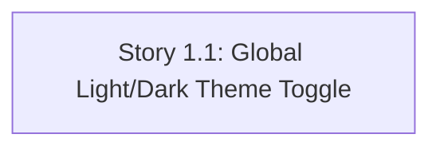

# ai-pdlc State Tracking

## Project Information
- **Project Type**: Brownfield
- **Start Date**: 2026-08-13T13:47:57Z
- **Current Stage**: INCEPTION - Workspace Detection

## Jira
- Parent Epic: AT-793
- Epic URL: https://3pillarglobal-demo.atlassian.net/browse/AT-793
- Project Key: AT

## Branching
- Base Branch: main
- Epic Branch: epic/AT-793-light-dark-theme-toggle
- Epic PR: https://github.com/Shailendrayadav0666/dyad_test/pull/1

## Workspace State
- **Existing Code**: Yes
- **Reverse Engineering Needed**: Yes
- **Workspace Root**: C:\Users\shailendra.yadav\Desktop\projects\rag-pdlc

## Code Location Rules
- **Application Code**: Workspace root (NEVER in aipdlc-docs/)
- **Documentation**: aipdlc-docs/ only
- **Structure patterns**: See code-generation.md Critical Rules

## Reverse Engineering Status
- [x] Reverse Engineering - Completed on 2026-08-13T13:51:43Z
- **Artifacts Location**: aipdlc-docs/inception/reverse-engineering/

## Team
- team_size: 1
- target_story_count: 1
- story_creation_mode: all-at-once

## Story Tracker
| Story ID | Title | Requires | Jira | Status | PR | Merged | Start | End | Recorded |
|---|---|---|---|---|---|---|---|---|---|
| 1.1 | Global Light/Dark Theme Toggle | none | AT-794 | 🟢 Ready for Development | — | — | | | 2026-08-13T14:12:49Z |

## Dependency Graph

**Ready-stories summary**: Story 1.1 has no prerequisites — immediately startable. Single-story epic, team_size = 1, so no parallelism constraint applies.

## Stage Progress
- [x] Workspace Detection
- [x] Reverse Engineering (approved)
- [x] Requirements Analysis (approved)
- [x] User Stories (approved, pushed to Jira as AT-794)
- [x] Dependency Graph (approved)
- [x] Workflow Planning (approved)
- [x] Application Design - SKIPPED

### 🟢 CONSTRUCTION PHASE
- [x] Functional Design - SKIPPED
- [x] NFR Requirements - SKIPPED
- [x] NFR Design - SKIPPED
- [x] Infrastructure Design - SKIPPED
- [ ] Code Generation - EXECUTE (awaiting `dev-implement`)

### 🟡 OPERATIONS PHASE
- [ ] Operations - PLACEHOLDER

## Current Status
- **Lifecycle Phase**: CONSTRUCTION
- **Current Stage**: Design complete — awaiting dev-implement
- **Next Stage**: Code Generation (Story 1.1, via `dev-implement`)
- **Status**: Ready to proceed
