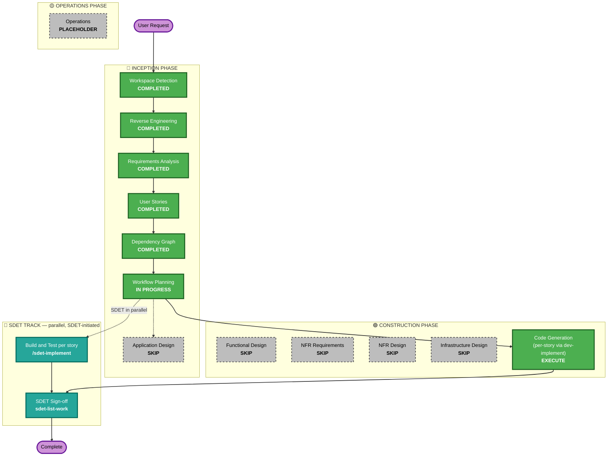

# Execution Plan — AT-793 Light / Dark Theme Toggle

## Detailed Analysis Summary

### Transformation Scope (Brownfield)
- **Transformation Type**: Single component change — frontend-only, within `frontend-react/`.
- **Primary Changes**: Add a global theme state (light/dark) and a header toggle control; apply theme via the existing styling approach (no new theming system, no CSS-in-JS library introduced).
- **Related Components**: `frontend-react/src` (header/navbar component, root App component/theme provider if one exists). No backend changes — the FastAPI backend and Qdrant layer are untouched.

### Change Impact Assessment
- **User-facing changes**: Yes — a new visible toggle control and full-app visual theme switch.
- **Structural changes**: No — no new services, no new architecture layers.
- **Data model changes**: No.
- **API changes**: No — zero backend/API involvement.
- **NFR impact**: Minor — instant rendering and contrast/readability in both themes (already captured as REQ-NF-01/02/03); no performance, security, or scalability implications.

### Component Relationships (Brownfield)
- **Primary Component**: `frontend-react/` (React/Vite SPA)
- **Infrastructure Components**: None
- **Shared Components**: None (no shared package between frontend/backend per reverse engineering)
- **Dependent Components**: None — this is a leaf-level UI change
- **Supporting Components**: None

### Risk Assessment
- **Risk Level**: Low — isolated, frontend-only, visual change with no backend/API/data touchpoints.
- **Rollback Complexity**: Easy — a single story/PR, revertible independently.
- **Testing Complexity**: Simple — manual QA checklist across pages in both themes (per requirements.md verification method).

## Workflow Visualization

## Phases to Execute

### 🔵 INCEPTION PHASE
- [x] Workspace Detection (COMPLETED)
- [x] Reverse Engineering (COMPLETED)
- [x] Requirements Analysis (COMPLETED)
- [x] User Stories (COMPLETED)
- [x] Dependency Graph (COMPLETED)
- [x] Execution Plan (IN PROGRESS)
- [ ] Application Design - **SKIP**
  - **Rationale**: The toggle is implemented entirely within the existing frontend component boundary (header/navbar) — no new components, services, or component-method contracts need defining.

### 🟢 CONSTRUCTION PHASE
- [ ] Functional Design - **SKIP**
  - **Rationale**: No new data models or complex business logic — the "business logic" here is a boolean theme flag toggled on click.
- [ ] NFR Requirements - **SKIP**
  - **Rationale**: All applicable NFRs (instant toggle, contrast/readability, no persistence) are already fully captured in requirements.md (REQ-NF-01..03); no tech-stack selection or new NFR category is introduced.
- [ ] NFR Design - **SKIP**
  - **Rationale**: Skipped because NFR Requirements was skipped — no NFR patterns to incorporate beyond what's already in requirements.md.
- [ ] Infrastructure Design - **SKIP**
  - **Rationale**: No infrastructure, deployment, or cloud resource changes — pure client-side UI change.
- [x] Code Generation - **EXECUTE (ALWAYS)**
  - **Rationale**: Implementation of Story 1.1 via `dev-implement`.

### 🧪 SDET TRACK (parallel — SDET-initiated, NOT scheduled by this workflow)
- Build and Test — run per story by SDET with `/sdet-implement`, in parallel with development.
- SDET Sign-off — run by SDET with `sdet-list-work` on the epic branch once the story PR merges.

### 🟡 OPERATIONS PHASE
- [ ] Operations - PLACEHOLDER

## Estimated Timeline
- **Total Phases**: 2 executed design-adjacent decisions (Workflow Planning + Code Generation); 5 conditional stages skipped.
- **Estimated Duration**: Single-story, trivial-complexity change — one `dev-implement` pass.

## Success Criteria
- **Primary Goal**: A working, instant global light/dark theme toggle in the header, meeting REQ-F-01..05 and REQ-NF-01..03.
- **Key Deliverables**: Story 1.1 implementation + unit tests (≥90% coverage per framework rule), PR into the epic branch.
- **Quality Gates**: Manual QA checklist (per requirements.md) run by SDET via `/sdet-implement`.
- **Integration Testing**: N/A — no backend/API integration involved.
