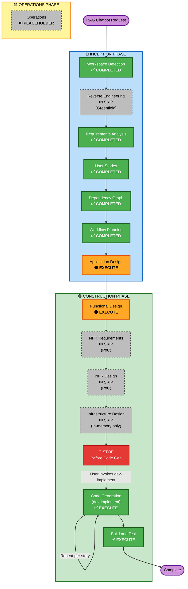

# Execution Plan — RAG Exam Preparation Chatbot

**Project Type**: Greenfield  
**Complexity**: Moderate  
**Risk Level**: Low  
**Team Size**: 1 Developer  
**Development Approach**: Code-First (Non-TDD)

---

## Detailed Analysis Summary

### Project Scope
- **Transformation Type**: Greenfield (new product)
- **Primary Changes**: Build complete RAG chatbot from scratch
- **Core Components**: PDF ingestion, vector embeddings, RAG pipeline, web interface, API

### Change Impact Assessment
- **User-facing changes**: ✅ Yes — Complete new web interface for exam prep
- **Structural changes**: ✅ Yes — New RAG architecture with 7 sequential stories
- **Data model changes**: ✅ Yes — Document chunks, embeddings, conversation context
- **API changes**: ✅ Yes — New REST API (upload, query)
- **NFR impact**: ⚠️ Limited — PoC stage; accuracy prioritized over performance/scalability

### Architecture Overview
The system consists of two primary layers:

**Backend RAG Pipeline**:
- PDF document ingestion and text extraction
- Text chunking and embedding generation
- Qdrant vector store integration
- Semantic search and retrieval
- LLM-based answer generation with citations

**Frontend Interface**:
- Web-based PDF upload
- Chat interface for Q&A
- Answer display with source citations
- Session management (stateless)

### Risk Assessment
- **Risk Level**: **Low**
  - Clear requirements with no ambiguity
  - Straightforward technology stack (Python, Qdrant, Claude API)
  - Single developer can focus without coordination overhead
  - PoC stage allows iterative refinement
- **Rollback Complexity**: Easy (each story is independent; can refactor incrementally)
- **Testing Complexity**: Moderate (unit testing per story, E2E testing in final story)

---

## Workflow Visualization



---

## Phases to Execute

### 🔵 INCEPTION PHASE
- [x] **Workspace Detection** — ✅ COMPLETED
- [x] **Reverse Engineering** — ⏭️ SKIP (Greenfield project, no existing code)
- [x] **Requirements Analysis** — ✅ COMPLETED
- [x] **User Stories** — ✅ COMPLETED (7 stories, 1 persona)
- [x] **Dependency Graph** — ✅ COMPLETED (7 sequential waves)
- [x] **Workflow Planning** — ✅ COMPLETED (this plan)
- [ ] **Application Design** — 🟠 **EXECUTE**
  - **Rationale**: New component architecture needed; RAG pipeline, API design, and data models require definition before code generation

### 🟢 CONSTRUCTION PHASE
- [ ] **Functional Design** — 🟠 **EXECUTE**
  - **Rationale**: Complex business logic (RAG pipeline, semantic search, citation formatting, LLM integration) requires detailed design
- [ ] **NFR Requirements** — ⏭️ **SKIP**
  - **Rationale**: PoC stage; security baseline disabled; accuracy prioritized over performance/scalability; no specific NFR thresholds to define
- [ ] **NFR Design** — ⏭️ **SKIP**
  - **Rationale**: Dependent on NFR Requirements; not applicable for PoC
- [ ] **Infrastructure Design** — ⏭️ **SKIP**
  - **Rationale**: Minimal infrastructure (Qdrant in-memory only); no cloud resources, deployment architecture, or scaling concerns for PoC
- [ ] **🛑 STOP** — **MANDATORY HALT**
  - After design stages complete, halt before code generation
  - Code generation begins ONLY when user invokes `dev-implement`
- [ ] **Code Generation** — ✅ **EXECUTE** (via `dev-implement` keyword, per-story)
  - **Rationale**: 7 stories implement the complete RAG chatbot; code-first approach
- [ ] **Build and Test** — ✅ **EXECUTE** (ALWAYS)
  - **Rationale**: Build, integration, performance, and E2E testing required for PoC validation

### 🟡 OPERATIONS PHASE
- [ ] **Operations** — ⏭️ **PLACEHOLDER**
  - **Rationale**: Future expansion (deployment, monitoring, incident response)

---

## Estimated Timeline

| Phase | Stages | Duration | Notes |
|-------|--------|----------|-------|
| **INCEPTION** | WD, RA, US, DG, WP, AD | ~1-2 days | Planning and design |
| **CONSTRUCTION** | FD, Code Gen (7 stories), BT | ~21-35 days | 3-5 days per story |
| **TOTAL** | 13 stages | ~22-37 days | Solo developer, sequential |

---

## Success Criteria

### Primary Goal
Deliver a working PoC of an RAG chatbot that enables students to upload PDFs and receive accurate, cited answers to exam preparation questions.

### Key Deliverables
- ✅ Fully functional RAG pipeline (ingestion → embedding → retrieval → generation)
- ✅ Web interface for PDF upload and Q&A
- ✅ REST API for backend operations
- ✅ Integration with Claude API for answer generation
- ✅ Comprehensive end-to-end testing
- ✅ Documentation and deployment instructions

### Quality Gates
- **Accuracy**: Answers must be grounded in uploaded PDF content
- **Citations**: Every answer includes exact source references (page/section)
- **Functionality**: All 7 user stories completed with acceptance criteria met
- **Testing**: E2E tests validate complete flow (upload → question → answer)
- **Code Quality**: Clean, maintainable code following best practices

---

## Key Artifacts Produced

### From Inception
- ✅ `requirements.md` — Detailed requirements
- ✅ `stories.md` — 7 user stories with acceptance criteria
- ✅ `personas.md` — Student persona
- ✅ `dependency-graph.yml` — Wave assignments and dependencies
- 🔄 `application-design/` — System design (to be created)
- 🔄 `functional-design/` — Business logic design (to be created)

### From Construction
- 🔄 Story implementation code (per-story via dev-implement)
- 🔄 Build and test instructions
- 🔄 Integration and E2E test coverage
- 🔄 API documentation
- 🔄 Deployment guide

---

## Architecture Summary

```
User Request
    ↓
[Web Interface] — PDF Upload, Chat UI
    ↓
[API Layer] — REST endpoints
    ↓
[RAG Pipeline]
  ├─ PDF Extraction (Story 1.1)
  ├─ Embedding Generation (Story 1.2)
  ├─ Vector Storage — Qdrant (Story 1.3)
  ├─ Semantic Search (Story 1.4)
  ├─ Answer Generation — Claude API (Story 1.5)
  └─ Citation Formatting
    ↓
[Response] — Answer + Source References
```

---

## Next Steps

1. ✅ Review this execution plan
2. ⏭️ Proceed to **Application Design** stage
3. ⏭️ Then **Functional Design** stage
4. ⏭️ Then **🛑 STOP** (before code generation)
5. ⏭️ User invokes `dev-implement` to build Story 1.1
6. ⏭️ Repeat `dev-implement` for Stories 1.2–1.7
7. ⏭️ Run Build and Test stage

---

**Document Version**: 1.0  
**Created**: 2026-07-09  
**Status**: Pending Approval
