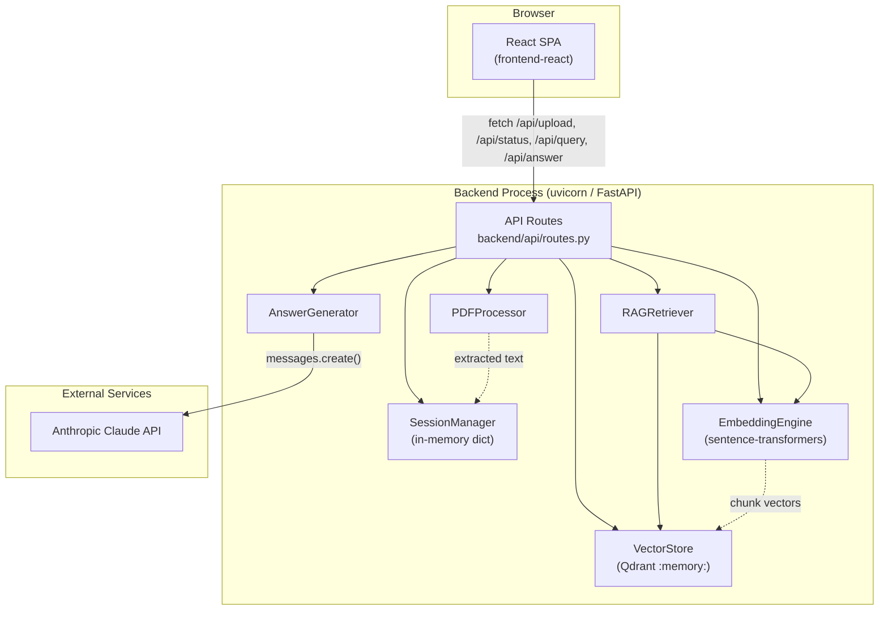
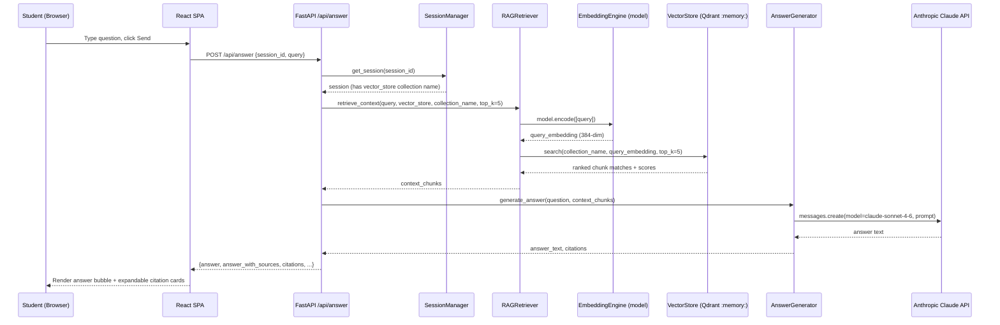

# System Architecture

## System Overview

A two-package monorepo: a React single-page app (`frontend-react/`) and a FastAPI backend (`backend/`) implementing a single-document RAG pipeline. There is no database server, no message queue, no auth layer, and no container/IaC definitions in the repo — verified by the absence of any `Dockerfile`, `docker-compose*.yml`, `.tf`, CloudFormation, or CDK files (`find . -iname "Dockerfile*" -o -iname "docker-compose*" -o -iname "*.tf" -o -iname "*.yaml" | grep -v node_modules` returns no matches other than none found). Vector storage is Qdrant running **in-memory inside the backend process** (`QdrantClient(":memory:")` in `backend/components/vector_store.py:36`), so it is not a separate deployed service — it is a library dependency. State (sessions, embeddings, vector collections) is entirely in-process and is lost on every backend restart; there is no persistence layer of any kind.

## Architecture Diagram

## Component Descriptions

### frontend-react (SPA)
- **Purpose**: Client UI for document upload and chat.
- **Responsibilities**: Render upload/chat views (`App.jsx` switches between `UploadSection` and `ChatSection` based on whether a `sessionId` exists), call the backend REST API (`src/api/client.js`), persist session id + chat history to `localStorage`.
- **Dependencies**: `react` 18.3.1, `react-dom` 18.3.1 (runtime); `vite` 5.4.0, `@vitejs/plugin-react` 4.3.1 (build/dev tooling). Depends on the backend being reachable at `/api` (proxied in dev — see Integration Points).
- **Type**: Application (client).

### backend/api (routes)
- **Purpose**: HTTP boundary — request validation, response shaping, error mapping.
- **Responsibilities**: Define the 4 REST endpoints (`/api/upload`, `/api/status/{id}`, `/api/query`, `/api/answer`); construct singleton component instances at import time (`pdf_processor`, `session_manager`, `embedding_engine`, `vector_store`, `rag_retriever`, `answer_generator`); wrap all component exceptions into structured JSON error responses.
- **Dependencies**: `backend/components/*`, `backend/utils/file_wrapper.py`, `fastapi`, `pydantic`.
- **Type**: Application (API layer).

### backend/components/pdf_processor.py (PDFProcessor)
- **Purpose**: Validate and parse uploaded PDF files.
- **Responsibilities**: Enforce 50 MB max size and non-empty file; verify the `%PDF` magic-byte header; extract page text (prefers `pdfplumber`, falls back to `PyPDF2` if unavailable); return page count/file size metadata.
- **Dependencies**: `pdfplumber` (primary), `PyPDF2` (optional fallback, not in `requirements.txt` — see Technology Stack caveat).
- **Type**: Application (domain component).

### backend/components/session_manager.py (SessionManager)
- **Purpose**: Track per-upload session state.
- **Responsibilities**: Create a UUID session on upload; store PDF text / embeddings / vector-store collection name / query history against it; raise `SessionNotFoundError` on unknown ids.
- **Dependencies**: none beyond the standard library (`uuid`, `datetime`).
- **Type**: Application (domain component). **No persistence** — pure in-memory `dict`.

### backend/components/embedding_engine.py (EmbeddingEngine)
- **Purpose**: Turn raw text into fixed-size chunks and vector embeddings.
- **Responsibilities**: Character-based sliding-window chunking (512 chars, 50 overlap by default); load and run the `all-MiniLM-L6-v2` `SentenceTransformer` model; batch-encode chunks (batch size 32) into 384-dim vectors.
- **Dependencies**: `sentence-transformers`, which pulls in `torch`.
- **Type**: Application (domain component).

### backend/components/vector_store.py (VectorStore)
- **Purpose**: Vector persistence and similarity search.
- **Responsibilities**: Create per-session Qdrant collections (cosine distance, 384-dim); upsert chunk vectors with `chunk_text`/`chunk_size`/`embedding_model` payload; run `query_points` (with a fallback to the deprecated `search()` for older `qdrant-client` versions) to retrieve top-k similar chunks; report collection stats.
- **Dependencies**: `qdrant-client` (in-memory mode — no external Qdrant server).
- **Type**: Application (domain component) — also fills the "data store" role via its embedded engine.

### backend/components/rag_retriever.py (RAGRetriever)
- **Purpose**: Orchestrate query embedding + vector search into ranked context.
- **Responsibilities**: Embed the incoming query using the shared `EmbeddingEngine`'s model directly (`self.embedding_engine.model.encode`, bypassing `EmbeddingEngine.process`'s chunking step); call `VectorStore.search`; format results with rank/score/chunk text; build a prompt-ready context string.
- **Dependencies**: `EmbeddingEngine`, `VectorStore`.
- **Type**: Application (domain component).

### backend/components/answer_generator.py (AnswerGenerator)
- **Purpose**: Generate a grounded, cited answer via Claude.
- **Responsibilities**: Build a RAG prompt template embedding the retrieved context and question; call `anthropic.Anthropic().messages.create` with model `claude-sonnet-4-6`, `max_tokens=1024`, `temperature=0.7`; parse `[Source #N]` markers out of the answer to build citations (falling back to an "implicit" citation of the top chunk if the model cites nothing explicitly); validate answer length (20–10000 chars); format a human-readable "## Sources" footer.
- **Dependencies**: `anthropic` SDK; requires `ANTHROPIC_API_KEY` env var — if absent, `routes.py` sets the singleton `answer_generator` to `None` and `/api/answer` returns a `500 api_key_missing` error (`backend/api/routes.py:25-28, 182-183`).
- **Type**: Application (domain component) — integration wrapper around an external LLM API.

### backend/utils/file_wrapper.py (UploadFileWrapper)
- **Purpose**: Adapter.
- **Responsibilities**: Wrap FastAPI's async `UploadFile`-derived `bytes` into a synchronous, seekable file-like object (`read`/`seek`/`tell`/`filename`) so the (framework-agnostic) `PDFProcessor` — written against a Flask-style file interface — can consume it unchanged.
- **Dependencies**: standard library `io` only.
- **Type**: Application (adapter/utility).

## Data Flow

Sequence for the primary "ask a question and get a cited answer" transaction (`POST /api/answer`):

## Integration Points

- **External APIs**: Anthropic Claude API (`anthropic` SDK, model `claude-sonnet-4-6`), called only from `AnswerGenerator.generate_answer` (`backend/components/answer_generator.py:103`). Requires `ANTHROPIC_API_KEY`.
- **Databases**: None (no SQL/NoSQL database in the repo).
- **Vector Store**: Qdrant, run in **in-memory embedded mode** (`QdrantClient(":memory:")`) — not a networked service, not persisted; one collection per session, dropped when the process restarts.
- **Third-party Services**: sentence-transformers `all-MiniLM-L6-v2` model — downloaded from Hugging Face Hub at first run (no explicit vendoring found; no offline-model configuration in code).
- **Frontend↔Backend wiring**: In dev, Vite's dev server proxies `/api/*` to `http://localhost:5000` (`frontend-react/vite.config.js:9-10`), while `backend/main.py:35` defaults its own listen port to `8000` if `PORT` is unset — a discrepancy noted in `code-quality-assessment.md` (the shipped `.env.example` does set `PORT=5000`, which resolves it in practice as long as `.env` is present).

## Infrastructure Components

- **CDK Stacks**: None found (no `cdk.json`, no AWS CDK dependencies in `frontend-react/package.json` or `requirements.txt`).
- **Deployment Model**: None defined in-repo — no `Dockerfile`, container orchestration file, or deployment scripts were found. The app is currently a local dev-only proof of concept (`uvicorn` run directly via `python backend/main.py`, `npm run dev` / `vite build` for the frontend).
- **Networking**: CORS is explicitly opened for `http://localhost:5173` and `http://localhost:3000` only (`backend/main.py:15-24`) — no VPC/subnet/security-group configuration exists (none is applicable, as there is no deployed infrastructure).
