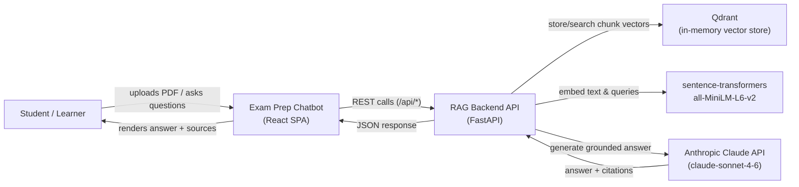

# Business Overview

## Business Context Diagram

## Business Description

- **Business Description**: The system is a Retrieval-Augmented Generation (RAG) chatbot proof-of-concept aimed at exam preparation. A student uploads a single PDF (course material / study guide); the backend extracts its text, splits it into overlapping chunks, embeds the chunks with a local sentence-transformers model, and stores the vectors in an in-memory Qdrant collection scoped to that upload's session. The student can then ask natural-language questions; the backend retrieves the most semantically relevant chunks and asks Anthropic's Claude API to answer the question strictly from that retrieved context, returning an answer annotated with citations back to the source chunks. There is no user account system, no persistence across server restarts, and no support for multiple documents per session — this is a single-document, single-session proof of concept, confirmed by `SessionManager` (`backend/components/session_manager.py`) keeping all state in a plain in-memory `dict` and `VectorStore` (`backend/components/vector_store.py`) using `QdrantClient(":memory:")`.
- **Business Transactions**:
  - **Upload & Index a Document** — `POST /api/upload`: validate a PDF, extract its text, chunk + embed it, create a per-session Qdrant collection, store the vectors, and return session metadata (page count, file size, chunk/vector counts). Implemented across `PDFProcessor`, `SessionManager`, `EmbeddingEngine`, `VectorStore` and orchestrated in `backend/api/routes.py::upload_pdf`.
  - **Check Session Status** — `GET /api/status/{session_id}`: look up an existing session's metadata (used by the frontend on page load to resume a previously uploaded document). Implemented in `backend/api/routes.py::get_status`.
  - **Retrieve Supporting Context for a Question** — `POST /api/query`: embed a question and run a similarity search against the session's vector collection, returning the raw ranked context chunks without generating a natural-language answer. Implemented in `backend/api/routes.py::query`, delegating to `RAGRetriever`.
  - **Get a Cited Answer to a Question** — `POST /api/answer`: the primary end-user transaction — retrieves context (same as above) and calls `AnswerGenerator` to produce a Claude-generated answer, validates the answer, and extracts/attaches citations back to the source chunks. Implemented in `backend/api/routes.py::answer`, used by the React `ChatSection` component.
- **Business Dictionary**:
  - **Session**: An ephemeral, in-memory record (UUID-keyed) tying one uploaded PDF's extracted text, embeddings, Qdrant collection name, and query history together. Created by `SessionManager.create_session` (`backend/components/session_manager.py:20`). Lost on backend process restart.
  - **Chunk**: A fixed-size (512 characters, 50-character overlap by default — `EmbeddingEngine.DEFAULT_CHUNK_SIZE` / `DEFAULT_OVERLAP` in `backend/components/embedding_engine.py:26-27`) slice of the extracted PDF text, the unit that gets embedded and searched.
  - **Embedding**: A 384-dimension numeric vector produced by the `all-MiniLM-L6-v2` sentence-transformers model (`backend/components/embedding_engine.py:28-29`) representing a chunk's or query's meaning.
  - **Collection**: A per-session Qdrant vector collection, named `session_{session_id}` (`backend/api/routes.py:91`), holding that session's chunk vectors.
  - **Context Chunk**: A search result — a chunk plus its similarity score and rank — returned by `RAGRetriever.retrieve_context` (`backend/components/rag_retriever.py:30`) and fed into the LLM prompt.
  - **Citation**: A reference from a generated answer back to a specific context chunk (by `Source #N` marker), extracted by `AnswerGenerator._extract_citations` (`backend/components/answer_generator.py:151`).

## Component Level Business Descriptions

### backend (FastAPI application — `backend/`)
- **Purpose**: Owns the entire RAG pipeline — PDF ingestion, embedding, vector storage/search, and LLM answer generation — and exposes it as a REST API.
- **Responsibilities**: Validate and parse uploaded PDFs; manage session lifecycle and in-memory state; chunk and embed text; create/query Qdrant collections; call Claude to produce grounded, cited answers; enforce basic input limits (file size ≤50 MB, query length ≤500 characters).

### frontend-react (React SPA — `frontend-react/`)
- **Purpose**: Provides the student-facing UI for uploading a PDF and chatting with it.
- **Responsibilities**: Drag-and-drop / click-to-browse PDF upload with client-side type/size pre-checks (`UploadSection.jsx`); persist the active `sessionId` and per-session chat history to `localStorage` so a refresh resumes the same document (`App.jsx`, `ChatSection.jsx`); render the conversation and expandable citation cards (`Message.jsx`); talk to the backend exclusively through the `/api/*` routes wrapped in `src/api/client.js`.
