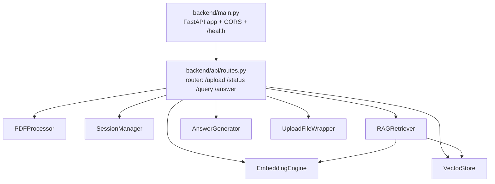
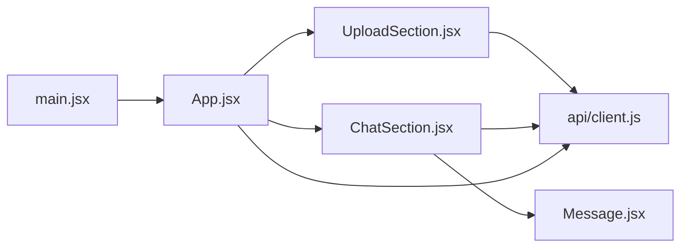

# Code Structure

## Build System

- **Backend**: Plain `pip` + `requirements.txt` at repo root (no Poetry/PDM/setup.py/pyproject.toml found — verified: `find . -iname "pyproject.toml" -o -iname "setup.py" -not -path "*/node_modules/*"` returns nothing). Run directly via `python -m backend.main` / `uvicorn backend.main:app`. A local `venv/` exists at the repo root (git-ignored).
- **Frontend**: **npm** + **Vite 5.4.0** (`frontend-react/package.json`, `frontend-react/vite.config.js`). Scripts: `dev` (`vite`), `build` (`vite build`), `preview` (`vite preview`). No monorepo tool (no Turborepo/Nx/Lerna/workspaces field) ties the two packages together — they are two independently-run projects sharing one git repo.
- **Note**: a root-level `context-project/` folder exists as a human-curated, AI-PDLC-managed context store (currently empty) — it is **not** application source and is never auto-scanned by this workflow.

## Key Classes/Modules

### Existing Files Inventory

Full source inventory (`find backend frontend-react/src -type f | sort`, excluding generated/lock files) — these are the brownfield modification candidates:

**Backend (`backend/`, 13 Python files)**
- `backend/__init__.py` — package docstring only, no logic.
- `backend/main.py` — FastAPI app factory: CORS setup (allows `localhost:5173`/`3000`), mounts the API router under `/api`, defines `GET /health`, and the `uvicorn.run` entrypoint (`PORT` env var, default 8000).
- `backend/api/__init__.py` — package docstring only.
- `backend/api/routes.py` — all 4 REST endpoints (`upload_pdf`, `get_status`, `query`, `answer`); constructs the module-level component singletons; the `QueryBody` Pydantic model; helper `err()`/`allowed_file()`.
- `backend/components/__init__.py` — package docstring only.
- `backend/components/pdf_processor.py` — `PDFProcessor`, `InvalidPDFError`, `FileReadError`: PDF validation (size/magic-bytes/parseability), text extraction (pdfplumber → PyPDF2 fallback), metadata extraction.
- `backend/components/embedding_engine.py` — `EmbeddingEngine`, `EmbeddingError`, `TextProcessingError`: sliding-window text chunking and `SentenceTransformer`-based batch embedding.
- `backend/components/vector_store.py` — `VectorStore`, `VectorStoreError`: in-memory Qdrant collection lifecycle (create/store/search/info), with a version-compatibility shim between `query_points` (qdrant-client ≥1.7) and the removed `search()` method.
- `backend/components/rag_retriever.py` — `RAGRetriever`, `RAGRetrieverError`: query embedding + vector search orchestration, result formatting, prompt-string building.
- `backend/components/answer_generator.py` — `AnswerGenerator`, `AnswerGeneratorError`: Claude API call with a fixed RAG prompt template, citation extraction via regex, answer validation, citation formatting for display.
- `backend/components/session_manager.py` — `SessionManager`, `SessionNotFoundError`: UUID-keyed in-memory session dict (create/store/get), tracks `last_activity`.
- `backend/utils/__init__.py` — empty file.
- `backend/utils/file_wrapper.py` — `UploadFileWrapper`: adapts FastAPI's byte content to the synchronous file-like interface `PDFProcessor` expects.

**Frontend (`frontend-react/`, 6 JS/JSX source files under `src/`, plus config)**
- `frontend-react/index.html` — Vite entry HTML; mounts `#root`, loads `src/main.jsx`.
- `frontend-react/vite.config.js` — Vite config: React plugin, dev server port 5173, `/api` proxy to `http://localhost:5000`.
- `frontend-react/package.json` — npm manifest (see Technology Stack).
- `frontend-react/src/main.jsx` — React root render entrypoint (`StrictMode` + `App`).
- `frontend-react/src/App.jsx` — top-level component: session bootstrap (restores `sessionId` from `localStorage`, validates it via `getStatus`), drag/drop guard, switches between `UploadSection` and `ChatSection`.
- `frontend-react/src/api/client.js` — thin `fetch` wrapper for the 3 client-called endpoints (`uploadPdf`, `getStatus`, `getAnswer`) plus shared JSON error handling.
- `frontend-react/src/components/UploadSection.jsx` — drag-and-drop / click-to-browse upload UI, client-side type/size validation, staged progress-text simulation during upload, calls `uploadPdf`.
- `frontend-react/src/components/ChatSection.jsx` — chat UI: message list, `localStorage`-persisted history per session, Ctrl+Enter submit, calls `getAnswer`.
- `frontend-react/src/components/Message.jsx` — renders one chat bubble; toggles an expandable citations list with match-percentage badges.
- `frontend-react/src/index.css` — all app styling (448 lines) — no CSS-in-JS or component-scoped stylesheets; one global stylesheet.

**Root-level**
- `requirements.txt` — backend Python dependencies (see Technology Stack).
- `.env.example` — sample environment file (documents `ANTHROPIC_API_KEY`, and Flask-era vars `FLASK_ENV`/`FLASK_DEBUG`/`PORT` left over from an earlier iteration of the backend — the current backend is FastAPI/uvicorn, not Flask; see Code Quality Assessment).
- `README.md`, `README copy.md`, `PROJECT_SUMMARY.md`, `AIPDLC-workflow.md`, `CLAUDE.md` — project documentation (not verified as ground truth for this analysis per the accuracy rules; treated only as narrative background).
- `context-project/` — empty, human-curated AI-PDLC context folder (see Build System note above).

## Design Patterns

### Adapter
- **Location**: `backend/utils/file_wrapper.py` (`UploadFileWrapper`).
- **Purpose**: Bridge FastAPI's async `UploadFile` byte content to the synchronous, seekable file-like interface (`filename`, `.read()`, `.seek()`, `.tell()`) that `PDFProcessor` expects.
- **Implementation**: Wraps raw `bytes` in an `io.BytesIO`, exposing `read`/`seek`/`tell` and a `filename` attribute.

### Strategy / Graceful Fallback (optional-dependency pattern)
- **Location**: `backend/components/pdf_processor.py` (`pdfplumber` vs `PyPDF2` for both validation and extraction) and `backend/components/vector_store.py::search` (`query_points` vs deprecated `search()` depending on installed `qdrant-client` version).
- **Purpose**: Tolerate missing optional libraries / API version drift without hard-crashing at import time.
- **Implementation**: `try/except ImportError` at module load sets the unavailable symbol to `None`; call sites branch on truthiness (`if pdfplumber: ... elif PdfReader: ... else: raise`), or, for Qdrant, on `hasattr(self.client, 'query_points')`.

### Singleton (module-level, not a formal singleton class)
- **Location**: `backend/api/routes.py:19-28` — `pdf_processor`, `session_manager`, `embedding_engine`, `vector_store`, `rag_retriever`, `answer_generator` are instantiated once at module import time and reused across all requests.
- **Purpose**: Avoid reloading the embedding model / recreating the Qdrant client / losing in-memory session state on every request.
- **Implementation**: Plain module-level variables; `answer_generator` additionally uses a `try/except AnswerGeneratorError` guard so a missing `ANTHROPIC_API_KEY` degrades the `/answer` endpoint (returns a `500`) instead of crashing the whole app at import.

### Custom exception hierarchy per component
- **Location**: Every component defines its own `Exception` subclass (`InvalidPDFError`, `FileReadError`, `EmbeddingError`, `TextProcessingError`, `VectorStoreError`, `RAGRetrieverError`, `AnswerGeneratorError`, `SessionNotFoundError`).
- **Purpose**: Let `backend/api/routes.py` catch component-specific failures and map each to a distinct HTTP status/error code via the shared `err()` helper.
- **Implementation**: Simple `class X(Exception): pass` definitions, one per component module.

## Critical Dependencies

(See `technology-stack.md` and `dependencies.md` for the full list with pinned vs. resolved versions.)

### fastapi
- **Version**: `>=0.115.0` in `requirements.txt`; `0.139.0` resolved in the local `venv`.
- **Usage**: Web framework for the entire backend (`backend/main.py`, `backend/api/routes.py`).
- **Purpose**: HTTP routing, request/response validation via Pydantic, async endpoint support.

### sentence-transformers
- **Version**: `>=3.0.1` in `requirements.txt`; `5.6.0` resolved in the local `venv`.
- **Usage**: `backend/components/embedding_engine.py` — loads `all-MiniLM-L6-v2` and encodes text chunks/queries into 384-dim vectors.
- **Purpose**: Local (non-API) text embedding for semantic search — no external embedding API call.

### qdrant-client
- **Version**: `>=1.18.0` in `requirements.txt`; `1.18.0` resolved.
- **Usage**: `backend/components/vector_store.py` — in-memory (`:memory:`) collection creation, upsert, and similarity search.
- **Purpose**: Vector similarity search backing the RAG retrieval step.

### anthropic
- **Version**: `>=0.34.0` in `requirements.txt`; `0.116.0` resolved.
- **Usage**: `backend/components/answer_generator.py` — `Anthropic(api_key=...).messages.create(...)`.
- **Purpose**: LLM call that turns retrieved context + question into a natural-language, citable answer.

### pdfplumber
- **Version**: `>=0.10.3` in `requirements.txt`; `0.11.10` resolved.
- **Usage**: `backend/components/pdf_processor.py` — primary PDF parsing/validation/text-extraction engine.
- **Purpose**: Extract per-page text from uploaded PDFs.
