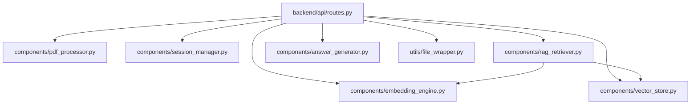

# Dependencies

## Internal Dependencies

There is no dependency between `frontend-react` and `backend` at the code level (no shared package/import) — they only interact over HTTP at runtime (see `architecture.md` Integration Points).

### `backend/api/routes.py` depends on `components/pdf_processor.py`
- **Type**: Runtime (import + module-level instantiation of `PDFProcessor()`).
- **Reason**: Validates and extracts text from uploaded PDFs for `/api/upload`.

### `backend/api/routes.py` depends on `components/session_manager.py`
- **Type**: Runtime.
- **Reason**: Session creation/lookup used by all 4 endpoints.

### `backend/api/routes.py` depends on `components/embedding_engine.py`
- **Type**: Runtime.
- **Reason**: Chunk + embed extracted PDF text during upload.

### `backend/api/routes.py` depends on `components/vector_store.py`
- **Type**: Runtime.
- **Reason**: Create/populate the per-session Qdrant collection during upload.

### `backend/api/routes.py` depends on `components/rag_retriever.py`
- **Type**: Runtime.
- **Reason**: Retrieve ranked context chunks for `/api/query` and `/api/answer`.

### `backend/api/routes.py` depends on `components/answer_generator.py`
- **Type**: Runtime.
- **Reason**: Generate the Claude-based answer for `/api/answer`.

### `backend/api/routes.py` depends on `utils/file_wrapper.py`
- **Type**: Runtime.
- **Reason**: Adapts the uploaded file bytes to the interface `PDFProcessor` expects.

### `components/rag_retriever.py` depends on `components/embedding_engine.py`
- **Type**: Runtime (constructor injection — `RAGRetriever.__init__(self, embedding_engine)`).
- **Reason**: Embeds the incoming query using the same model used to embed document chunks.

### `components/rag_retriever.py` depends on `components/vector_store.py`
- **Type**: Runtime (method parameter, not constructor-injected — `retrieve_context(..., vector_store, ...)`).
- **Reason**: Runs the similarity search against the session's collection.

## External Dependencies

Versions: left column is the constraint in `requirements.txt` / `package.json`; right-hand note gives the version actually resolved (`venv/Lib/site-packages/*.dist-info` for Python, `frontend-react/package-lock.json` for JS). License information is not vendored in this repo (no `LICENSE` files ship with these packages here) — licenses below are the publicly known license for each project, not verified from repo files.

### fastapi
- **Version**: `>=0.115.0` declared / `0.139.0` resolved.
- **Purpose**: Backend HTTP framework — routing, request/response models, async support.
- **License**: MIT.

### uvicorn[standard]
- **Version**: `>=0.30.0` declared / `0.51.0` resolved.
- **Purpose**: ASGI server that runs the FastAPI app.
- **License**: BSD-3-Clause.

### python-multipart
- **Version**: `>=0.0.12` declared.
- **Purpose**: Parses `multipart/form-data` for the `/api/upload` file field.
- **License**: Apache-2.0.

### pdfplumber
- **Version**: `>=0.10.3` declared / `0.11.10` resolved.
- **Purpose**: Primary PDF parsing, validation, and text extraction.
- **License**: MIT.

### python-dotenv
- **Version**: `>=1.0.1` declared.
- **Purpose**: Loads `.env` into process environment (`backend/main.py:9`) — primarily for `ANTHROPIC_API_KEY`.
- **License**: BSD-3-Clause.

### sentence-transformers
- **Version**: `>=3.0.1` declared / `5.6.0` resolved.
- **Purpose**: Loads and runs `all-MiniLM-L6-v2` for local text embedding (no external embedding API call).
- **License**: Apache-2.0.

### numpy
- **Version**: `>=1.26.0` declared / `2.4.6` resolved.
- **Purpose**: Numeric array support underpinning `sentence-transformers`/`torch` outputs.
- **License**: BSD-3-Clause.

### torch
- **Version**: `>=2.3.0` declared / `2.13.0` resolved.
- **Purpose**: Tensor runtime backing the `sentence-transformers` model.
- **License**: BSD-3-Clause (modified).

### qdrant-client
- **Version**: `>=1.18.0` declared / `1.18.0` resolved.
- **Purpose**: In-memory vector database client used for chunk storage and similarity search.
- **License**: Apache-2.0.

### anthropic
- **Version**: `>=0.34.0` declared / `0.116.0` resolved.
- **Purpose**: Calls the Claude API to generate grounded answers.
- **License**: MIT.

### react / react-dom
- **Version**: `^18.3.1` declared / `18.3.1` resolved (`frontend-react/package-lock.json`).
- **Purpose**: Frontend UI rendering.
- **License**: MIT.

### vite
- **Version**: `^5.4.0` declared.
- **Purpose**: Frontend dev server + production bundler.
- **License**: MIT.

### @vitejs/plugin-react
- **Version**: `^4.3.1` declared.
- **Purpose**: Enables JSX transform + React Fast Refresh in Vite.
- **License**: MIT.

**Not declared but imported** (see `technology-stack.md` caveat): `PyPDF2` is referenced as an optional fallback in `backend/components/pdf_processor.py` but is absent from `requirements.txt` — it will not be installed by a plain `pip install -r requirements.txt`.
